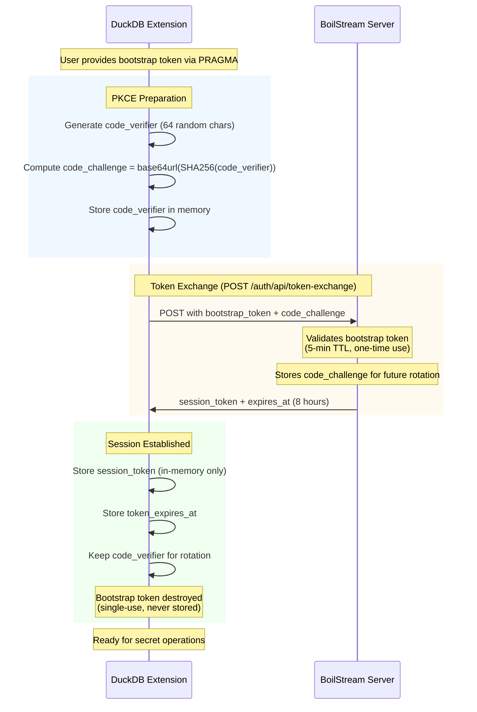
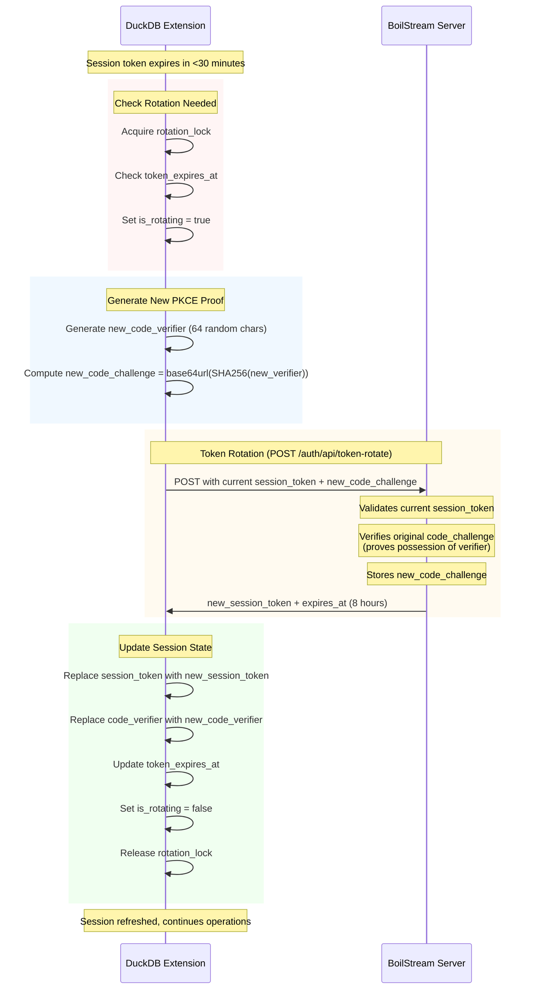

# BoilStream DuckDB Extension

This extension allows you to use [boilstream](https://github.com/boilingdata/boilstream) server as a remote secure Secrets Storage.

> You can also create your own server that implements the required [REST API](src/README.md) to work with `boilstream` extension.

## Running the extension

1. Download and run [boilstream](https://github.com/boilingdata/boilstream)
2. Open BoilStream [web auth console](https://docs.boilstream.com/guide/auth/postgresql-web-auth.html#_2-login-options), register, and generate web token
3. Load the extension and provide token using PRAGMA as below

```
% duckdb # -unsigned
D -- LOAD 'build/release/extension/boilstream/boilstream.duckdb_extension';
D INSTALL boilstream FROM community;
D LOAD boilstream;
D PRAGMA duckdb_secrets_boilstream_endpoint('https://localhost:443/secrets:ffe14a7a000000010000000168e4f9a5bcca736c3adaaf0f63e735f881adc397db6da85f1b9e231f70bbf6f71db4ef9fad837bc8');
┌─────────────────────────────────────────────┐
│                   result                    │
│                   varchar                   │
├─────────────────────────────────────────────┤
│ Boilstream endpoint configured successfully │
└─────────────────────────────────────────────┘
D FROM duckdb_secrets();
┌──────────────┬─────────┬──────────┬────────────┬────────────┬──────────────────────┬───────────────────────────────────────────────────────────────────────────────────┐
│     name     │  type   │ provider │ persistent │  storage   │        scope         │                                   secret_string                                   │
│   varchar    │ varchar │ varchar  │  boolean   │  varchar   │      varchar[]       │                                      varchar                                      │
├──────────────┼─────────┼──────────┼────────────┼────────────┼──────────────────────┼───────────────────────────────────────────────────────────────────────────────────┤
│ my_s3_secret │ s3      │ config   │ true       │ boilstream │ ['s3://my-test-buc…  │ name=my_s3_secret;type=s3;provider=config;serializable=true;scope=s3://my-test-…  │
│ test_crud    │ s3      │ config   │ true       │ boilstream │ ['s3://', 's3n://'…  │ name=test_crud;type=s3;provider=config;serializable=true;scope=s3://,s3n://,s3a…  │
└──────────────┴─────────┴──────────┴────────────┴────────────┴──────────────────────┴───────────────────────────────────────────────────────────────────────────────────┘
```

## Security: PKCE Token Exchange Flows

### Bootstrap Token Exchange (Initial Authentication)

The extension uses PKCE (Proof Key for Code Exchange, RFC 7636) to securely exchange a short-lived bootstrap token for a long-lived session token.



**Key Security Properties:**

- Bootstrap token: 5-minute TTL, single-use only
- Code verifier: Never transmitted to server, kept in memory only
- Code challenge: One-way SHA256 hash proves possession of verifier
- Session token: 8-hour lifetime, stored in-memory only

### Session Token Rotation (Automatic Refresh)

When the session token is about to expire (<30 minutes remaining), the extension automatically rotates it using the stored code verifier.



**Key Security Properties:**

- Rotation uses existing session token + proof of verifier possession
- New code verifier generated for each rotation (forward secrecy)
- Rotation is atomic and thread-safe (mutex-protected)
- Failed rotation keeps old session token valid
- Prevents concurrent rotations with `is_rotating` flag

### Token Lifecycle Summary

| Token Type      | Lifetime  | Storage                     | Use                                |
| --------------- | --------- | --------------------------- | ---------------------------------- |
| Bootstrap Token | 5 minutes | User-provided, never stored | Initial exchange only (single-use) |
| Code Verifier   | 8 hours   | In-memory only              | PKCE proof for rotation            |
| Session Token   | 8 hours   | In-memory only              | API authentication                 |
| Code Challenge  | 8 hours   | Server-side                 | Validates rotation requests        |

**Rotation Trigger:** Session token auto-rotates when <30 minutes remain before expiry.
