# Boilstream Security Specification v1.0

## Overview

This document specifies the authentication, key derivation, encryption, and integrity protection mechanisms for the Boilstream DuckDB extension and compatible server implementations.

**Security Architecture**:

- **Authentication**: OPAQUE PAKE (RFC 9807) - password-authenticated key exchange without password transmission
- **Key Derivation**: HKDF-SHA256 (RFC 5869) - derives separate keys from OPAQUE session_key
- **Request Signing**: AWS Signature Version 4 compatible - HMAC-SHA256 with canonical request format
- **Response Encryption**: AES-256-GCM (NIST SP 800-38D) or ChaCha20-Poly1305 (RFC 8439)
- **Hijacking Prevention**: Lock-step sequence protocol with monotonic counters
- **Session Resumption**: One-time use resumption keys derived from session_key via HKDF

**Key Design Principle**: All cryptographic keys derive from the OPAQUE-generated `session_key`. No keys are transmitted over the network.

**Transport Layer Security**:

- **TLS is MANDATORY**: All communication MUST occur over TLS 1.3 or later (HTTPS)
- **Client message confidentiality**: TLS provides confidentiality for client→server messages (requests)
- **Client message integrity**: HMAC signatures provide integrity independent of TLS (defense in depth)
- **Server message confidentiality**: Application-layer encryption (AES-256-GCM/ChaCha20-Poly1305) provides confidentiality for server→client messages (responses)
- **Server message integrity**: HMAC signatures provide integrity independent of TLS (defense in depth)
- **Rationale**: This protocol provides authentication and integrity protection without relying on TLS, but TLS is required for baseline transport security and client request confidentiality

---

## Credentials and Keys

### Credential Hierarchy

| Credential         | Source                    | Lifetime          | Transmission | Storage             | Purpose                     |
| ------------------ | ------------------------- | ----------------- | ------------ | ------------------- | --------------------------- |
| `access_token`     | Server-generated (random) | Server-determined | Yes (HTTPS)  | In-memory           | HTTP session identifier     |
| `session_key`      | OPAQUE-derived (64 bytes) | Server-determined | Never        | In-memory only      | Root key for HKDF           |
| `refresh_token`    | HKDF(session_key)         | Server-determined | Never        | Encrypted on disk   | Session resumption          |
| `base_signing_key` | HKDF(session_key)         | Server-determined | Never        | In-memory (derived) | Base for request signing    |
| `encryption_key`   | HKDF(session_key)         | Server-determined | Never        | In-memory (derived) | Response decryption         |
| `integrity_key`    | HKDF(session_key)         | Server-determined | Never        | In-memory (derived) | Response HMAC verification  |
| `signing_key`      | AWS-style scoped key      | Daily             | Never        | In-memory (derived) | Request HMAC (date-scoped)  |
| `client_sequence`  | Counter (starts at 0)     | Session           | Yes (header) | In-memory           | Lock-step sequence tracking |

### Security Properties

**MUST**:

- `session_key` MUST NEVER be transmitted or persisted to disk
- `refresh_token` MUST be one-time use and rotated on every resumption
- All derived keys MUST be zeroized on session end
- Client MUST respect server-provided `expires_at` value
- `client_sequence` MUST reset to 0 on new session establishment

**MUST NOT**:

- MUST NOT log access tokens or any derived keys
- MUST NOT reuse nonces for encryption operations
- MUST NOT persist `session_key` to any storage medium

---

## Authentication Protocol (OPAQUE)

### Initial Login Flow

**Standard**: IETF RFC 9807

**OPAQUE Configuration**: OPAQUE-3DH with ristretto255 and SHA-256 (corresponds to RFC 9807 Appendix A.1 - OPAQUE-3DH with ristretto255 and SHA-256)

**Parameters**:

- **Group**: ristretto255
- **Hash**: SHA-256 (used internally by OPAQUE protocol)
- **KDF**: HKDF-SHA-256 (used within OPAQUE)
- **MAC**: HMAC-SHA-256 (used within OPAQUE)
- **KSF**: Identity (no additional key stretching; OPAQUE already provides adequate protection)

**Actors**:

- **User**: Registers via web interface with username + password
- **Server**: Stores OPAQUE password file
- **Client**: DuckDB extension initiating authentication

**Steps**:

1. **User obtains bootstrap token**:

   - User registers/logs in via web GUI over **HTTPS** (TLS 1.3+ required)
   - Server generates one-time `bootstrap_token` with cryptographically secure random number generator (CSPRNG)
   - **Bootstrap token security requirements**:
     - MUST have minimum 256 bits of entropy (e.g., 32 random bytes, base64-encoded = 43 characters minimum)
     - MUST have maximum lifetime of 5 minutes from generation
     - MUST be marked as consumed after first use
     - MUST be transmitted from web GUI to user over HTTPS only
   - Bootstrap token displayed to user for copy (web GUI should use secure display methods)
   - **Security considerations**:
     - Web GUI MUST use HTTPS (TLS 1.3+) to prevent token interception
     - Web GUI SHOULD implement click-to-reveal or copy-to-clipboard to reduce shoulder surfing risk
     - Server SHOULD log bootstrap token generation attempts for security monitoring
     - Server MUST delete expired bootstrap tokens (older than 5 minutes and unused)

2. **Client initiates OPAQUE login**:

   - User executes: `PRAGMA duckdb_secrets_boilstream_endpoint('https://server/secrets/:BOOTSTRAP_TOKEN')`
   - Client parses URL, extracts bootstrap token
   - Client computes user_id: `user_id = lowercase_hex(SHA256(bootstrap_token))`
   - Client calls `OPAQUE::ClientLogin::start(bootstrap_token)` → generates `CredentialRequest`
   - Client prepares request with both user_id (hash) and credential_request (OPAQUE output)

3. **Client → Server: Login Start**:

   ```
   POST /auth/api/opaque-login-start
   Content-Type: application/json

   {
     "user_id": "<64-char-hex-sha256-hash-of-bootstrap-token>",
     "credential_request": "<base64-encoded CredentialRequest>"
   }
   ```

   **Fields**:

   - `user_id`: SHA-256 hash of bootstrap token, lowercase hexadecimal (64 characters)
   - `credential_request`: OPAQUE protocol credential request (RFC 9807)

   **Note**: Bootstrap token itself is NEVER transmitted (only its hash for lookup). OPAQUE uses bootstrap token as password input client-side only.

4. **Server processes login start**:

   - Extract `user_id` from request (SHA-256 hash of bootstrap token)
   - Lookup OPAQUE password file: `password_file = opaque_password_files[user_id]`
   - If not found: return `401 Unauthorized` with error code `INVALID_CREDENTIALS` (constant-time error to prevent user enumeration)
   - Call `OPAQUE::ServerLogin::start(password_file, credential_request)`
   - Generate `CredentialResponse`

5. **Server → Client: Login Start Response**:

   ```
   HTTP/1.1 200 OK
   Content-Type: application/json

   {
     "credential_response": "<base64-encoded CredentialResponse>",
     "state_id": "<server-generated-opaque-state-identifier>"
   }
   ```

   **Fields**:

   - `credential_response`: OPAQUE protocol credential response (RFC 9807)
   - `state_id`: Server-generated opaque identifier to correlate login-start with login-finish. Client MUST echo this value in the login-finish request. The format and contents are server-implementation specific. This is required because OPAQUE ServerLogin maintains server-side state between the two protocol steps.

6. **Client finishes OPAQUE**:

   - Call `OPAQUE::ClientLogin::finish(credential_response)`
   - **Derives**: `session_key` (64 bytes) from OPAQUE-3DH protocol
   - **Derives**: `refresh_token = HKDF-Expand(session_key, "session-resumption-v1", 32 bytes)`
   - Generate `CredentialFinalization`

7. **Client → Server: Login Finish**:

   ```
   POST /auth/api/opaque-login-finish
   Content-Type: application/json

   {
     "state_id": "<state-id-from-login-start-response>",
     "credential_finalization": "<base64-encoded CredentialFinalization>"
   }
   ```

   **Fields**:

   - `state_id`: The opaque state identifier received from login-start response. Server uses this to retrieve the ServerLogin state.
   - `credential_finalization`: OPAQUE protocol credential finalization (RFC 9807)

8. **Server validates and establishes session**:

   - Call `OPAQUE::ServerLogin::finish(credential_finalization)`
   - Validation success → derives same `session_key` as client (via OPAQUE protocol)
   - Generate random `access_token` (32-byte hex string, 64 lowercase characters)
   - Mark bootstrap_token as consumed (one-time use)
   - Calculate expiration: `expires_at = now() + <server_policy>` (e.g., 1-24 hours based on security requirements)

9. **Both client and server derive refresh_token**:

   - Client: `refresh_token = HKDF-Expand(session_key, "session-resumption-v1", 32 bytes)`
   - Server: `refresh_token = HKDF-Expand(session_key, "session-resumption-v1", 32 bytes)`
   - Both parties independently derive the same refresh_token from shared session_key

10. **Server registers refresh_token for future resume**:

- Compute resume_user_id: `resume_user_id = lowercase_hex(SHA256(refresh_token))`
- Register refresh_token with OPAQUE via full registration protocol:
  - `client_reg = ClientRegistration::start(refresh_token)` (server simulates client)
  - `server_reg = ServerRegistration::start(ServerSetup, client_reg.message, resume_user_id)`
  - `client_finish = client_reg.finish(refresh_token, server_reg.message)`
  - `password_file = ServerRegistration::finish(client_finish.message)`
- Store OPAQUE password file: `opaque_password_files[resume_user_id] = password_file`
- Store metadata: `resumption_metadata[resume_user_id] = {original_user_id, expires_at, used: false, file_type: "resumption"}`
- Link resume identity to original user for session recreation

**Critical**: Server performs both client and server sides of OPAQUE registration locally to create password file for refresh_token. This is secure because refresh_token is derived (not user-chosen) and both parties already possess it.

11. **Server → Client: Login Success**:

```
HTTP/1.1 200 OK
Content-Type: application/json
X-Boilstream-Date: 20251009T120100Z
X-Boilstream-Response-Signature: <base64-HMAC-SHA256-signature>
X-Boilstream-Session-Resumption: enabled

{
  "access_token": "<64-char-hex>",
  "token_type": "Bearer",
  "expires_at": 1234567890,
  "region": "us-east-1"
}
```

**Critical**:

- `session_key` is NOT included in response. Both client and server derive it independently via OPAQUE protocol (RFC 9807 Section 6.2.3)
- `refresh_token` is derived from `session_key` and MUST NEVER be transmitted over the network
- Server MUST sign response using `integrity_key` derived from `session_key`
- `X-Boilstream-Session-Resumption` header indicates if server supports session resumption

12. **Client verifies response signature and stores credentials**:

    - **Verify response signature**: Using `integrity_key` derived from `session_key`, verify `X-Boilstream-Response-Signature` header
    - **Check X-Boilstream-Session-Resumption**: If `enabled`, client MAY persist `refresh_token`; if `disabled` or absent, client MUST NOT persist
    - **In-memory**: `access_token`, `session_key` (from OPAQUE), derived keys (`base_signing_key`, `encryption_key`, `integrity_key`), `region`, `client_sequence = 0`
    - **Encrypted on disk** (if resumption enabled): `refresh_token` (from HKDF), `expires_at`, `region`, `endpoint`

**Result**: Client authenticated, ready to make signed/encrypted requests.

---

### User Identity Derivation

**Purpose**: Provide lookup keys for OPAQUE password files without transmitting secrets.

**Bootstrap Token Identity**:

```
user_id = lowercase_hex(SHA256(bootstrap_token))
```

- Used for initial login
- Server pre-computes this hash when creating bootstrap token
- Stored as index for OPAQUE password file lookup
- Bootstrap token itself never transmitted over network

**Refresh Token Identity**:

```
resume_user_id = lowercase_hex(SHA256(refresh_token))
```

- Used for session resumption
- Both client and server compute this hash after deriving refresh_token from session_key
- Stored as index for resume OPAQUE password file lookup
- refresh_token itself never transmitted over network

**Security Properties**:

- SHA-256 prevents rainbow table attacks (one-way function)
- Hash collision resistance ensures unique identities
- Bootstrap token and refresh_token never transmitted
- OPAQUE protocol uses actual secrets as passwords (client-side only)
- Server cannot derive original secrets from hashes

### Session Resumption Flow

**Trigger**: DuckDB restarts, finds stored `refresh_token` with remaining TTL

**Design**: Session resumption reuses the OPAQUE login endpoint with full OPAQUE protocol. refresh_token serves as OPAQUE password (never transmitted). Server distinguishes resume from bootstrap login by checking which identity namespace (user_id vs resume_user_id) the hash belongs to.

**Steps**:

1. **Client loads stored credentials**:

   - Read `refresh_token`, `expires_at`, `region`, `endpoint` from encrypted storage
   - Verify: `now() < expires_at`
   - If expired: delete credentials, require new PRAGMA
   - Compute resume_user_id: `resume_user_id = lowercase_hex(SHA256(refresh_token))`
   - Call `OPAQUE::ClientLogin::start(refresh_token)` → generates `CredentialRequest`
   - Client prepares request with both resume_user_id (hash) and credential_request (OPAQUE output)

2. **Client → Server: Resume Request** (reuses OPAQUE endpoint):

   ```
   POST /auth/api/opaque-login-start
   Content-Type: application/json

   {
     "user_id": "<64-char-hex-sha256-hash-of-refresh-token>",
     "credential_request": "<base64-encoded OPAQUE CredentialRequest>"
   }
   ```

   **Fields**:

   - `user_id`: SHA-256 hash of refresh_token, lowercase hexadecimal (64 characters)
   - `credential_request`: OPAQUE protocol credential request (RFC 9807)

   **Note**: refresh_token itself is NEVER transmitted (only its hash for lookup). OPAQUE uses refresh_token as password input client-side only.

3. **Server distinguishes resume from login**:

   - Extract `user_id` from request
   - Lookup: `metadata = resumption_metadata[user_id]`
   - **If found** → Resume flow (user_id matches a refresh_token hash in resumption_metadata)
   - **If not found** → Bootstrap login flow (user_id matches a bootstrap token hash)
   - Lookup corresponding OPAQUE password file: `password_file = opaque_password_files[user_id]`
   - If password file not found: return `401 Unauthorized` with error code `INVALID_CREDENTIALS` (constant-time error)

4. **Server validates refresh token metadata**:

   - Retrieve metadata: `{original_user_id, expires_at, used, file_type} = resumption_metadata[user_id]`
   - Verify: `file_type == "resumption" AND now() < expires_at AND used == false`
   - If expired: return `401 Unauthorized` with error code `REFRESH_TOKEN_EXPIRED`
   - If already used: return `401 Unauthorized` with error code `REFRESH_TOKEN_USED`

5. **Server processes resume via OPAQUE**:

   - Use stored OPAQUE password file: `password_file = opaque_password_files[user_id]`
   - Call `OPAQUE::ServerLogin::start(password_file, credential_request)`
   - Generate `CredentialResponse` (same as bootstrap login)

6. **Server → Client: Resume Success**:

   ```
   HTTP/1.1 200 OK
   Content-Type: application/json

   {
     "credential_response": "<base64-encoded OPAQUE CredentialResponse>",
     "state_id": "<server-generated-opaque-state-identifier>"
   }
   ```

   **Note**: Returns OPAQUE `credential_response` and `state_id` just like login-start, allowing client to complete OPAQUE protocol and derive new session_key. The `state_id` is stored in memory temporarily and used in the resume-finish request.

7. **Client completes OPAQUE protocol**:

   - Call `OPAQUE::ClientLogin::finish(credential_response)` using old refresh_token as password
   - **Derives**: NEW `session_key` (64 bytes) from OPAQUE-3DH protocol
   - **Derives**: NEW `refresh_token = HKDF-Expand(NEW session_key, "session-resumption-v1", 32 bytes)`
   - Generate `CredentialFinalization`

8. **Client → Server: Resume Finish**:

   ```
   POST /auth/api/opaque-login-finish
   Content-Type: application/json

   {
     "state_id": "<state-id-from-resume-start-response>",
     "credential_finalization": "<base64-encoded CredentialFinalization>"
   }
   ```

   **Note**: Client uses the `state_id` received from the resume-start response (step 6). This is stored in memory only, not persisted to disk.

9. **Server validates finalization and invalidates old session**:

   - Call `OPAQUE::ServerLogin::finish(credential_finalization)`
   - Validation success → derives NEW `session_key` from OPAQUE protocol
   - **CRITICAL**: Delete old session (invalidate old access_token and all derived keys)
   - **CRITICAL**: Mark old refresh_token as used: `resumption_metadata[old_resume_user_id].used = true`

10. **Server derives and rotates refresh_token**:

- **Derive**: NEW `refresh_token = HKDF-Expand(NEW session_key, "session-resumption-v1", 32 bytes)`
- Generate NEW `access_token` (32-byte hex string, 64 lowercase characters)
- Compute new_resume_user_id: `new_resume_user_id = lowercase_hex(SHA256(NEW refresh_token))`
- Register NEW refresh_token with OPAQUE (server simulates full registration):
  - `client_reg = ClientRegistration::start(NEW refresh_token)`
  - `server_reg = ServerRegistration::start(ServerSetup, client_reg.message, new_resume_user_id)`
  - `client_finish = client_reg.finish(NEW refresh_token, server_reg.message)`
  - `password_file = ServerRegistration::finish(client_finish.message)`
- Store new OPAQUE password file: `opaque_password_files[new_resume_user_id] = password_file`
- **PRESERVE expiration**: `same_expires_at = original_expires_at` (NO extension)
- Store new metadata: `resumption_metadata[new_resume_user_id] = {original_user_id, same_expires_at, used: false, file_type: "resumption"}`
- Delete old OPAQUE password file: `delete opaque_password_files[old_resume_user_id]`
- Create new session with NEW session_key, reset `expected_sequence = 0`

11. **Server returns session details**:

```
HTTP/1.1 200 OK
Content-Type: application/json
X-Boilstream-Date: 20251009T120200Z
X-Boilstream-Response-Signature: <base64-HMAC-SHA256-signature>
X-Boilstream-Session-Resumption: enabled

{
  "access_token": "<64-char-hex>",
  "token_type": "Bearer",
  "expires_at": 1234567890,
  "region": "us-east-1"
}
```

**Critical**:

- Response MUST NOT include `session_key` or `refresh_token` (client derived both from OPAQUE session_key)
- Server MUST sign response using NEW `integrity_key` derived from NEW `session_key`
- This is identical to initial login - neither session_key nor refresh_token are ever transmitted

12. **Client verifies response and updates credentials**:

    - **Verify response signature**: Using NEW `integrity_key` derived from NEW `session_key`, verify `X-Boilstream-Response-Signature` header
    - **Check X-Boilstream-Session-Resumption**: If `enabled`, client MAY persist NEW `refresh_token`; if `disabled`, client MUST NOT persist
    - **In-memory**: Store NEW `access_token`, NEW `session_key` (from OPAQUE), derive NEW keys (`base_signing_key`, `encryption_key`, `integrity_key`), `region`, reset `client_sequence = 0`
    - **Encrypted storage** (if resumption enabled): DELETE old refresh_token, STORE NEW refresh_token (derived from NEW session_key via HKDF)

**Result**: Transparent reconnection without re-authentication. User does not need to re-run PRAGMA.

**Security**:

- refresh_token used as OPAQUE password (never transmitted; only SHA-256 hash sent for lookup)
- Full OPAQUE zero-knowledge proof for resume (same security as initial login)
- Server cannot derive refresh_token from SHA-256 hash (one-way function)
- Old refresh_token cannot be reused (one-time use, rotates on every resume)
- Old session_key invalidated (new session_key from OPAQUE on every resume)
- If attacker steals and uses refresh_token first, legitimate user's resume fails (theft detection)
- Session lifetime never extended (expires_at preserved from original login)

**Refresh Token Theft Risk**:

Session resumption introduces a security trade-off between usability and risk:

- **Risk**: If an attacker compromises disk encryption and steals the `refresh_token`, they can resume the session before the legitimate user and access all secrets during the session lifetime (up to 24 hours maximum)
- **Detection**: Theft is only detected when the legitimate user attempts to resume and discovers the key has already been used
- **Time window**: The attacker has a window from theft until either (a) legitimate user attempts resume or (b) session expires
- **Mitigation options**:
  - Servers can **disable session resumption** by omitting or setting `X-Boilstream-Session-Resumption: disabled` in login responses
  - When disabled, clients MUST NOT persist `refresh_token` to disk
  - High-security deployments SHOULD disable session resumption to eliminate this attack vector
  - If resumption is enabled, session lifetimes SHOULD be kept short (e.g., 1-4 hours instead of 24 hours)
  - Servers SHOULD monitor for multiple resume attempts from different locations/IPs as potential theft indicators
- **Default behavior**: If `X-Boilstream-Session-Resumption` header is absent, clients MUST assume resumption is disabled and MUST NOT persist credentials

---

## Key Derivation

### Base Key Derivation (HKDF-SHA256)

**Standard**: RFC 5869

**Purpose**: Derive separate base keys for different cryptographic operations from OPAQUE `session_key`.

**Parameters**:

- **IKM**: `session_key` (64 bytes from OPAQUE-3DH Key Exchange output - RFC 9807 Section 6.2.3, the `session_key` value output by both ClientLogin::finish() and ServerLogin::finish())
- **Salt**: `boilstream-session-v1` (UTF-8, 21 bytes)
- **Hash**: SHA-256 (FIPS 180-4)
- **Output**: 32 bytes per derived key

**Critical**: Both client and server MUST use the identical `session_key` output from the OPAQUE protocol. This is automatically guaranteed by RFC 9807 - both parties derive the same value without transmitting it.

**Note**: OPAQUE-3DH with ristretto255 produces 64-byte session_key, providing 512 bits of entropy as input to HKDF-SHA256 for key derivation.

**Base Keys**:

| Derived Key        | Info String              | Output Size | Usage                                  |
| ------------------ | ------------------------ | ----------- | -------------------------------------- |
| `base_signing_key` | `request-integrity-v1`   | 32 bytes    | Base key for AWS-style request signing |
| `encryption_key`   | `response-encryption-v1` | 32 bytes    | Decrypt encrypted responses            |
| `integrity_key`    | `response-integrity-v1`  | 32 bytes    | HMAC verification of response payloads |
| `refresh_token`    | `session-resumption-v1`  | 32 bytes    | Session resumption (OPAQUE password)   |

**Process**:

```
PRK = HMAC-SHA256(salt="boilstream-session-v1", IKM=session_key)
T(1) = HMAC-SHA256(PRK, info || 0x01)
derived_key = T(1)[0:32]
```

### Session Resumption Key Derivation

**Purpose**: Derive a one-time refresh token from `session_key` for transparent session resumption without re-authentication.

**Parameters**:

- **IKM**: `session_key` (64 bytes from OPAQUE-3DH)
- **Salt**: `boilstream-session-v1` (same as base keys)
- **Info**: `session-resumption-v1` (UTF-8, 22 bytes)
- **Output**: 32 bytes

**Process**:

```
PRK = HMAC-SHA256(salt="boilstream-session-v1", IKM=session_key)
T(1) = HMAC-SHA256(PRK, "session-resumption-v1" || 0x01)
refresh_token = T(1)[0:32]  // 32 bytes
```

**Properties**:

- Both client and server derive identical `refresh_token` from shared `session_key`
- refresh_token is used as OPAQUE password for session resumption
- refresh_token rotates on every session resumption (new session_key → new refresh_token)
- refresh_token MUST NEVER be transmitted over network
- refresh_token stored encrypted on disk for automatic reconnection

### Request Signing Key Derivation (AWS SigV4 Style)

**Purpose**: Derive date and region-scoped signing keys from `base_signing_key`.

**Process**:

```
kDate = HMAC-SHA256(base_signing_key, date)      # date = YYYYMMDD
kRegion = HMAC-SHA256(kDate, region)              # region = "us-east-1" etc.
kService = HMAC-SHA256(kRegion, "secrets")        # service = "secrets"
signing_key = HMAC-SHA256(kService, "boilstream_request")
```

**Benefits**:

- Date-scoped keys (automatic daily rotation from same session_key)
- Region-specific keys (multi-region deployment support)
- Service-specific keys (cross-service isolation)

**Lifecycle**:

- `signing_key` changes daily (new date = new key)
- Must re-derive when date changes (UTC timezone)
- Base keys (`base_signing_key`, `encryption_key`, `integrity_key`) cached for session duration

---

## Cipher Suite Negotiation

### Supported Cipher Suites

Cipher suites follow the naming convention: `BOILSTREAM-<KDF>-<AEAD>-<MAC>`

| Suite ID | Priority | Name                                                 | KDF         | AEAD              | MAC         | Status        |
| -------- | -------- | ---------------------------------------------------- | ----------- | ----------------- | ----------- | ------------- |
| `0x0001` | 1        | `BOILSTREAM-HKDF-SHA256-AES256GCM-HMACSHA256`        | HKDF-SHA256 | AES-256-GCM       | HMAC-SHA256 | **Mandatory** |
| `0x0002` | 2        | `BOILSTREAM-HKDF-SHA256-CHACHA20POLY1305-HMACSHA256` | HKDF-SHA256 | ChaCha20-Poly1305 | HMAC-SHA256 | Optional      |

**Mandatory Requirement**: All implementations MUST support suite `0x0001` (AES-256-GCM with hardware acceleration support).

**Priority**: Lower priority number = more secure/preferred. Priority determines server selection order.

### Negotiation Protocol

**Client Request Headers**:

```
X-Boilstream-Ciphers: 0x0001, 0x0002
X-Boilstream-Cipher-Version: 1
```

**Server Response Headers**:

```
X-Boilstream-Cipher: 0x0001
X-Boilstream-Cipher-Version: 1
```

### Negotiation Rules

1. **Client sends supported suites**: Client lists all supported cipher suite IDs (order irrelevant)
2. **Server selects most secure**: Server MUST select highest priority (lowest priority number) from mutually-supported suites
3. **Fallback**: If client omits `X-Boilstream-Ciphers` header, server MUST use `0x0001` (mandatory suite)
4. **Version mismatch**: If `X-Boilstream-Cipher-Version` incompatible, server returns `426 Upgrade Required`
5. **No common suite**: Server returns `400 Bad Request` with `{"error": "No supported cipher suite"}`

**Example**: Client sends `0x0001, 0x0002`. Server supports both. Server selects `0x0001` (priority 1 < priority 2).

### Version Compatibility

Current version: `1`

Future versions MUST maintain backward compatibility OR clearly document breaking changes.

---

## Message Integrity Protection (Bidirectional)

### Purpose

Provide integrity protection, replay prevention, and authentication for both client requests and server responses independent of TLS. This protection is symmetrical - both parties use HMAC-SHA256 signatures over canonical message formats.

### Signing Approach

**Algorithm**: HMAC-SHA256
**Key**:

- **Requests**: Date-scoped signing key derived from `base_signing_key` using AWS-style derivation
- **Responses**: `integrity_key` derived from session_key via HKDF

**Encoding**: Base64 (RFC 4648 with padding)

Both request and response signatures use the same HMAC-SHA256 algorithm with canonical message formats.

### Canonical Message Format (Unified)

**Standard**: AWS Signature Version 4 (modified for Boilstream)

Both requests and responses use canonical message formats with the following components separated by newlines:

**Request Canonical Format** (6 components):

```
HTTPMethod
CanonicalURI
CanonicalQueryString
CanonicalHeaders
SignedHeaders
HashedPayload
```

**Response Canonical Format** (4 components):

```
HTTPStatusCode
CanonicalHeaders
SignedHeaders
HashedPayload
```

**Note**: Responses omit the URI and query string components. Both formats share the same structure for CanonicalHeaders, SignedHeaders, and HashedPayload.

### Component Specifications

**Request-Only Components**:

1. **HTTPMethod**: HTTP verb in uppercase (`GET`, `POST`, `PUT`, `DELETE`)

2. **CanonicalURI**: URI-encoded path component

   - Empty path = `/`
   - Example: `/secrets/my-secret` → `/secrets/my-secret`
   - URI-encode all characters except: `A-Z a-z 0-9 - _ . ~ /`
   - Use percent-encoding with UPPERCASE hexadecimal digits (e.g., `%2C` not `%2c`)
   - Do NOT encode forward slash (`/`) in URI path

3. **CanonicalQueryString**: Sorted and encoded query parameters

   - No query params = empty string
   - Format: `param1=value1&param2=value2`
   - Sort by parameter name (lexicographic)
   - URI-encode names and values (same rules as CanonicalURI)
   - Parameters with empty values: `param=` → `param=` (keep equals sign)
   - Parameters without values: `param` → `param=` (add equals sign)

**Response-Only Components**:

1. **HTTPStatusCode**: Three-digit HTTP status code as string

   - Example: `200`, `401`, `500`
   - No leading zeros or spaces

**Common Components** (both requests and responses):

1. **CanonicalHeaders**: Lowercase header names with normalized values

   - Format: `header1:value1\nheader2:value2\n`
   - **Include ALL headers starting with `x-boilstream-` prefix**
   - **Exclusions**:
     - Requests: Exclude `x-boilstream-signature` (the signature being computed)
     - Responses: Exclude `x-boilstream-response-signature` (the signature being computed)
   - Sort by header name (lexicographic)
   - Lowercase header names
   - Trim leading and trailing whitespace from values (0x20, 0x09)
   - Collapse sequential internal spaces to single space
   - Must end with newline character
   - **Forward compatibility**: Future specification versions MAY define new `x-boilstream-*` headers. Implementations MUST sign all such headers present in messages, even if unknown to the implementation. This ensures signature verification works across versions. Headers prefixed with `x-boilstream-nosign-` are reserved for future non-signable headers.
   - **Current v1.0 request headers**: `x-boilstream-cipher-version`, `x-boilstream-ciphers`, `x-boilstream-credential`, `x-boilstream-date`, `x-boilstream-sequence`
   - **Current v1.0 response headers**: `x-boilstream-cipher`, `x-boilstream-date`, `x-boilstream-encrypted`, `x-boilstream-session-resumption`

2. **SignedHeaders**: Semicolon-separated list of signed header names

   - Format: `header1;header2`
   - Must match headers in CanonicalHeaders section
   - Lowercase, sorted lexicographically
   - **Request example**: `x-boilstream-cipher-version;x-boilstream-ciphers;x-boilstream-credential;x-boilstream-date;x-boilstream-sequence`
   - **Response example**: `x-boilstream-cipher;x-boilstream-date;x-boilstream-session-resumption`
   - **Blank line**: The CanonicalHeaders section ends with a newline character (per requirement above), and the SignedHeaders component begins immediately after, creating a blank line between CanonicalHeaders and SignedHeaders in the canonical message. This blank line is required and MUST be present for signature verification to succeed.

3. **HashedPayload**: Hex-encoded SHA-256 hash of message body

   - Empty body: `e3b0c44298fc1c149afbf4c8996fb92427ae41e4649b934ca495991b7852b855`
   - Hash body bytes, encode as lowercase hexadecimal (64 characters)
   - All hex output MUST be lowercase
   - Applies to both request bodies and response bodies

### Examples

**Example Canonical Request**:

```
POST
/secrets

x-boilstream-cipher-version:1
x-boilstream-ciphers:0x0001, 0x0002
x-boilstream-credential:a7f3c8e2/20251009/us-east-1/secrets/boilstream_request
x-boilstream-date:20251009T120000Z
x-boilstream-sequence:42

x-boilstream-cipher-version;x-boilstream-ciphers;x-boilstream-credential;x-boilstream-date;x-boilstream-sequence
44136fa355b3678a1146ad16f7e8649e94fb4fc21fe77e8310c060f61caaff8a
```

**Note**: All `x-boilstream-*` headers present in the request are included (except `x-boilstream-signature`). Headers are sorted lexicographically by lowercase name.

**Security Note**: The URI path is `/secrets` (generic endpoint), NOT `/secrets/my-secret`. Secret names and sensitive information MUST be in the POST body, never in the URI path. TLS provides confidentiality for the body, but URI paths may be logged by proxies, load balancers, or appear in access logs.

**Example Canonical Response** (Login Success):

```
200
x-boilstream-cipher:0x0001
x-boilstream-date:20251009T120100Z
x-boilstream-session-resumption:enabled

x-boilstream-cipher;x-boilstream-date;x-boilstream-session-resumption
da33e0fe781a362817e8e8aaa7af0ce141c7dc676ef385f83a1920d667b54f32
```

**Note**: All `x-boilstream-*` headers present in the response are included (except `x-boilstream-response-signature`). Headers are sorted lexicographically by lowercase name.

### Credential Scope Format

**Format**: `<session-token-prefix>/<date>/<region>/<service>/boilstream_request`

**Components**:

- `session-token-prefix`: First 8 characters of session_token (hex)
- `date`: YYYYMMDD format (UTC)
- `region`: Deployment region identifier (e.g., `us-east-1`, `eu-west-1`)
- `service`: Always `secrets`
- `terminator`: Always `boilstream_request`

**Example**: `a7f3c8e2/20251009/us-east-1/secrets/boilstream_request`

**Note**: Credential scope is request-specific and not used in response signing.

### Request Signing Process (Client)

1. **Get current date**: `date = format_date(now(), "YYYYMMDD")` (UTC)
2. **Read sequence**: `seq = client_sequence` (read current value, do NOT increment yet)
3. **Hash payload**: `payload_hash = lowercase_hex(SHA256(request_body))`
4. **Build canonical request**: Construct as specified above
5. **Derive signing key**: Use AWS-style derivation with date + region + service
6. **Compute signature**: `signature = HMAC-SHA256(signing_key, canonical_request)`
7. **Encode signature**: `signature_b64 = base64_encode(signature)` using RFC 4648 (with padding)
8. **Build credential scope**: Format as specified above
9. **Send HTTP request**: Transmit request over network via HTTP client library
10. **Increment sequence**: `client_sequence++` immediately after the HTTP client's send operation returns, regardless of success or failure

**Sequence Increment and Retry Policy**:

- Client MUST increment `client_sequence` immediately after the HTTP client library's send/request function returns (whether it succeeds, times out, or fails with a connection error)
- The increment is irreversible - once incremented, the old sequence number is invalidated
- **On any error after increment** (timeout, connection reset, no response): Client MUST NOT retry with the same sequence number
- **Retry options after error**:
  - (a) Re-authenticate to establish a new session starting at sequence 0, or
  - (b) Continue with the next sequence number for a new request (accepting the previous request's status is unknown)
- **Session desync prevention**: If client loses track of sequence (crash, restart, etc.), client MUST re-authenticate - attempting to resume or guess the sequence will trigger session kill
- **Idempotency recommendation**: Application logic should handle potential duplicate requests gracefully, as network issues may create uncertainty about server processing

### Request Headers

All authenticated requests MUST include:

```
Authorization: Bearer <session_token>
X-Boilstream-Date: <ISO8601 timestamp>
X-Boilstream-Sequence: <sequence_number>
X-Boilstream-Signature: <base64_signature>
X-Boilstream-Credential: <credential_scope>
X-Boilstream-Ciphers: 0x0001, 0x0002
X-Boilstream-Cipher-Version: 1
```

**Header Formats**:

- `X-Boilstream-Date`: ISO8601 format `YYYYMMDDTHHMMSSZ` (UTC)
- `X-Boilstream-Sequence`: Unsigned 64-bit integer (decimal)
- `X-Boilstream-Signature`: Base64-encoded HMAC-SHA256 output (RFC 4648 with padding)
- `X-Boilstream-Credential`: Credential scope string

**Session Token Format**:

- MUST be 32-byte hexadecimal string (64 lowercase characters, no dashes)
- Example: `da33e0fe781a362817e8e8aaa7af0ce141c7dc676ef385f83a1920d667b54f32`

### Server Validation

Server MUST validate in this order:

1. **Extract session**: Lookup session by `session_token` from Authorization header
2. **Check expiry**: Verify `now() < session.expires_at`
3. **Parse credential scope**: Extract date, region, service from `X-Boilstream-Credential`
4. **Validate date**: The date in credential scope MUST be within ±1 calendar day (UTC) of server's current UTC date. This allows signing keys to work across date boundaries and accommodates clock skew. Example: if server date is 2025-10-09, accept dates 2025-10-08, 2025-10-09, or 2025-10-10.
5. **Validate timestamp**: `|now() - parse_iso8601(X-Boilstream-Date)| <= 60 seconds` - provides tighter time-based security than date validation
6. **Validate sequence**: `received_sequence == session.expected_sequence` (exact match)
7. **Derive signing key**: Use same AWS-style derivation with extracted date/region from credential scope
8. **Reconstruct canonical request**: Build same canonical request as client
9. **Verify signature**: `HMAC-SHA256(signing_key, canonical_request) == received_signature` (constant-time comparison)
10. **Increment sequence**: `session.expected_sequence += 1`

**Constant-Time Comparison**:

- MUST use cryptographic library's constant-time comparison function
- Prevents timing side-channel attacks
- Example implementations: `crypto.timingSafeEqual()` (Node.js), `hmac.compare_digest()` (Python), `subtle.ConstantTimeCompare()` (Go)

### Validation Failures

| Condition         | Action                   | HTTP Status        |
| ----------------- | ------------------------ | ------------------ |
| Date invalid      | Reject request           | `401 Unauthorized` |
| Timestamp expired | Reject request           | `401 Unauthorized` |
| Sequence mismatch | **Kill session**, reject | `401 Unauthorized` |
| Invalid signature | **Kill session**, reject | `401 Unauthorized` |
| Session not found | Reject request           | `401 Unauthorized` |
| Session expired   | Delete session, reject   | `401 Unauthorized` |

**Critical**: Sequence mismatch or invalid signature MUST immediately invalidate the session (delete from server state).

### Response Signing Process (Server)

Server MUST sign responses when `session_key` is available (after OPAQUE login/resume finalize).

1. **Get current timestamp**: `timestamp = format_timestamp(now(), "YYYYMMDDTHHMMSSZ")` (UTC, ISO8601)
2. **Hash payload**: `payload_hash = lowercase_hex(SHA256(response_body))`
3. **Build canonical response**: Construct as specified above (status code + canonical headers + signed headers + hashed payload)
4. **Derive integrity key**: `integrity_key = HKDF-Expand(session_key, "response-integrity-v1", 32)` (already derived in session)
5. **Compute signature**: `signature = HMAC-SHA256(integrity_key, canonical_response)`
6. **Encode signature**: `signature_b64 = base64_encode(signature)` using RFC 4648 (with padding)
7. **Add response headers**:
   - `X-Boilstream-Date`: Current timestamp (ISO8601 format)
   - `X-Boilstream-Response-Signature`: Base64-encoded signature
   - `X-Boilstream-Session-Resumption`: Session resumption capability (`enabled` or `disabled`)
   - `X-Boilstream-Cipher`: Selected cipher suite (if applicable)
   - `X-Boilstream-Encrypted`: `true` or `false` (if applicable)

**When to Sign**:

- MUST sign: `/auth/api/opaque-login-finish` responses (after server derives session_key)
- MUST sign: All authenticated endpoint responses (when session exists)
- MUST NOT sign: `/auth/api/opaque-login-start` responses (no session_key available yet)
- MUST NOT sign: Error responses before OPAQUE finalization (no session_key available)

### Response Headers

Server MUST include these headers in signed responses:

```
X-Boilstream-Date: 20251009T120100Z
X-Boilstream-Response-Signature: <base64_signature>
X-Boilstream-Session-Resumption: enabled
X-Boilstream-Cipher: 0x0001
X-Boilstream-Encrypted: true
Content-Type: application/json
```

**Header Formats**:

- `X-Boilstream-Date`: ISO8601 format `YYYYMMDDTHHMMSSZ` (UTC)
- `X-Boilstream-Response-Signature`: Base64-encoded HMAC-SHA256 output (RFC 4648 with padding)
- `X-Boilstream-Session-Resumption`: Either `enabled` or `disabled` (indicates server resumption support)

**X-Boilstream-Session-Resumption Header**:

- **Purpose**: Indicates whether server supports session resumption for security policy flexibility
- **Values**:
  - `enabled`: Server supports session resumption (will accept resumption_key-based resume)
  - `disabled`: Server does NOT support session resumption (client MUST NOT store resumption_key)
- **When to send**: MUST be present in `/auth/api/opaque-login-finish` responses
- **Client behavior**: If `disabled` or header absent, client MUST NOT persist resumption_key to disk
- **Security**: Allows high-security deployments to disable on-disk credential storage

### Client Response Verification

Client MUST verify response signatures when received:

1. **Check for signature header**: If `X-Boilstream-Response-Signature` present, verify it
2. **Derive integrity key**: `integrity_key = HKDF-Expand(session_key, "response-integrity-v1", 32)`
3. **Hash response body**: `payload_hash = lowercase_hex(SHA256(response_body))`
4. **Reconstruct canonical response**: Build same canonical response as server (status code + headers + hashed payload)
5. **Verify signature**: `HMAC-SHA256(integrity_key, canonical_response) == base64_decode(received_signature)` (constant-time comparison)
6. **Validate timestamp**: `|now() - parse_iso8601(X-Boilstream-Date)| <= 60 seconds`
7. **On failure**: Treat as tampering, reject response, terminate session

**Constant-Time Comparison**: MUST use cryptographic library's constant-time comparison function to prevent timing attacks.

**Note**: Client cannot verify `/auth/api/opaque-login-start` responses (no session_key yet). Response signing begins after OPAQUE finalization when both parties have session_key.

---

## Response Encryption

**IMPORTANT - Integrity Protection**:

Encrypted responses have TWO layers of integrity protection:

1. **AEAD authentication tag**: Built into AES-256-GCM/ChaCha20-Poly1305 ciphertext (16-byte tag appended to ciphertext)

   - Provides authenticated encryption
   - Protects ciphertext integrity and authenticity

2. **Response signature** (header `X-Boilstream-Response-Signature`): Protects the entire HTTP response including all headers and body hash
   - Computed over canonical response format (status code + headers + body hash)
   - Uses `integrity_key` derived from session_key
   - Uses HMAC-SHA256 over canonical response string

Both layers MUST be verified by the client: response signature first (validates HTTP response), then AEAD decryption (validates ciphertext).

### Encryption Format

When server encrypts responses, use the following JSON structure:

```json
{
  "encrypted": true,
  "nonce": "<base64-encoded nonce>",
  "ciphertext": "<base64-encoded ciphertext+tag>"
}
```

**Response Headers**:

```
X-Boilstream-Cipher: 0x0001
X-Boilstream-Encrypted: true
Content-Type: application/json
```

### Encryption Process (Server)

**Pattern**: Encrypt-then-MAC (defense in depth: AEAD tag + separate HMAC)

**Order of operations** (CRITICAL for interoperability):

1. **Derive keys**:

   - `encryption_key = HKDF-Expand(session_key, "response-encryption-v1", 32)`
   - `integrity_key = HKDF-Expand(session_key, "response-integrity-v1", 32)`

2. **Generate nonce**: 12 random bytes from CSPRNG (MUST be unique per encryption)

3. **Encrypt plaintext** (FIRST):

   - **AES-256-GCM** (suite 0x0001): `ciphertext_with_tag = AES256GCM.encrypt(encryption_key, nonce, plaintext_json)`
   - **ChaCha20-Poly1305** (suite 0x0002): `ciphertext_with_tag = ChaCha20Poly1305.encrypt(encryption_key, nonce, plaintext_json)`
   - Both produce ciphertext with 16-byte AEAD authentication tag appended
   - **Output format**: `ciphertext_with_tag = ciphertext_bytes || aead_tag` (16-byte tag at end)

4. **Compute HMAC AFTER encryption** (SECOND):

   ```
   hmac_input = nonce || ciphertext_with_tag
   ```

   **Explicit byte concatenation**:

   - `nonce`: 12 bytes (raw bytes, NOT encoded)
   - `ciphertext_with_tag`: N+16 bytes (N bytes ciphertext + 16 bytes AEAD tag, raw bytes, NOT encoded)
   - Total HMAC input: 12 + N + 16 bytes

   ```
   hmac = HMAC-SHA256(integrity_key, hmac_input)
   ```

   **Output**: 32-byte HMAC-SHA256 digest

5. **Encode response** (THIRD):

   - `nonce`: Base64-encode (RFC 4648 with padding, 12 bytes → 16 chars)
   - `ciphertext`: Base64-encode ciphertext_with_tag (RFC 4648 with padding), where ciphertext_with_tag is N+16 bytes (N bytes plaintext ciphertext + 16-byte AEAD authentication tag)
   - `hmac`: Hex-encode lowercase (32 bytes → 64 chars)

### Decryption Process (Client)

**Order of operations** (CRITICAL for interoperability):

1. **Parse response**: Extract `nonce`, `ciphertext`, `hmac` fields from JSON

2. **Derive keys**: Same as server

   - `encryption_key = HKDF-Expand(session_key, "response-encryption-v1", 32)`
   - `integrity_key = HKDF-Expand(session_key, "response-integrity-v1", 32)`

3. **Decode fields** (FIRST):

   - `nonce_bytes = base64_decode(nonce)` → 12 bytes
   - `ciphertext_with_tag_bytes = base64_decode(ciphertext)` → N+16 bytes
   - `hmac_bytes = hex_decode(hmac)` → 32 bytes

4. **Verify HMAC BEFORE decryption** (SECOND - MUST happen before decryption):

   ```
   hmac_input = nonce_bytes || ciphertext_with_tag_bytes
   ```

   **Explicit byte concatenation**:

   - `nonce_bytes`: 12 bytes (decoded)
   - `ciphertext_with_tag_bytes`: N+16 bytes (decoded)
   - Total HMAC input: 12 + N + 16 bytes (exact same as server computed)

   ```
   expected_hmac = HMAC-SHA256(integrity_key, hmac_input)
   if NOT constant_time_compare(hmac_bytes, expected_hmac):
       throw "Response tampering detected"
   ```

   **Constant-Time Comparison**: MUST use cryptographic library's constant-time function to prevent timing attacks.

5. **Decrypt ciphertext** (THIRD - only after HMAC verification succeeds):

   - **AES-256-GCM**: `plaintext = AES256GCM.decrypt(encryption_key, nonce_bytes, ciphertext_with_tag_bytes)`
   - **ChaCha20-Poly1305**: `plaintext = ChaCha20Poly1305.decrypt(encryption_key, nonce_bytes, ciphertext_with_tag_bytes)`
   - AEAD tag verification is automatic (authenticated decryption)
   - **Input**: `nonce_bytes` (12 bytes) + `ciphertext_with_tag_bytes` (N+16 bytes)
   - **Output**: `plaintext` (N bytes) - the original JSON

6. **Handle failure**:

   - If HMAC verification fails: Reject response, throw error `401 Unauthorized` (tampering detected)
   - If decryption fails: Throw error `500 Internal Server Error` (corruption or key mismatch)
   - NEVER proceed with decryption if HMAC verification fails

**Complete Client Verification Flow for Encrypted Responses**:

The client MUST perform BOTH integrity checks in this order:

1. **FIRST**: Verify `X-Boilstream-Response-Signature` header (validates entire HTTP response including headers)
2. **SECOND**: Decode and verify response body `hmac` field (validates encrypted payload before decryption)
3. **THIRD**: Decrypt ciphertext (only after both integrity checks pass)

This provides defense in depth: response signature prevents header tampering, body HMAC prevents payload tampering.

### Encoding Standards

**Base64**: RFC 4648 standard base64 encoding with padding (NOT base64url variant)

- Alphabet: `A-Z a-z 0-9 + /`
- Padding: `=` character when needed
- Example: `dGVzdA==` (not `dGVzdA`)

**Hexadecimal**:

- All hexadecimal encoding MUST use lowercase letters
- Applies to: `user_id`, `resume_user_id`, `session_token`, `hmac` values, `HashedPayload`, credential scope components
- Example: `a7f3c8e2` (correct), `A7F3C8E2` (incorrect)
- **Note**: HTTP header names may be transmitted with any case due to HTTP case-insensitivity, but header names MUST be converted to lowercase before canonical request construction

### Nonce Requirements

- **Size**: Exactly 12 bytes (96 bits)
- **Generation**: CSPRNG (cryptographically secure random number generator)
- **Uniqueness**: MUST be unique per encryption operation (NEVER reuse with same key)
- **Transmission**: Base64-encoded in response

### Security Properties

- **Confidentiality**: AES-256 or ChaCha20 encryption
- **Integrity**: AEAD authentication tag + separate HMAC (defense in depth)
- **Authenticity**: HMAC binds response to session
- **Performance**: Hash-then-sign pattern (O(1) signature size vs O(N) for full body)

---

## Lock-Step Sequence Protocol

### Purpose

Prevent session hijacking by enforcing exactly one valid request path. Even if an attacker steals `session_token` + `session_key`, they cannot issue requests without knowing the exact current sequence number.

### Protocol

**Client State**:

- Maintains `client_sequence` counter (uint64)
- Initialized to 0 on login/resume
- Incremented after each request transmission
- Never decremented or reset except on new session

**Server State**:

- Maintains `expected_sequence` per session (uint64)
- Initialized to 0 on login/resume
- Incremented after successful request validation
- Session deleted on sequence mismatch

### Request Flow

1. **Client prepares request**:

   - Read current `client_sequence` value: `seq = client_sequence`
   - Build and sign request with `seq` in canonical request and `X-Boilstream-Sequence` header
   - Send HTTP request
   - Increment counter AFTER transmission: `client_sequence++`

2. **Server validates request**:

   - Extract `received_seq` from `X-Boilstream-Sequence` header
   - Compare: `received_seq == session.expected_sequence`
   - If match: Process request, increment `session.expected_sequence++`
   - If mismatch: **DELETE SESSION**, return `401 Unauthorized`

### Attack Scenarios

**Scenario 1: Token Theft**

- Legitimate client at sequence 42
- Attacker steals session credentials via memory dump
- Attacker guesses sequence 0 and sends request
- Server expects 42 → mismatch → session killed → attacker blocked
- Legitimate user's next request also fails (session gone, must re-authenticate)

**Scenario 2: Concurrent Access**

- User on laptop sends request (seq=100)
- User on phone sends request (seq=100) simultaneously
- Server processes first request → expects seq=101 next
- Second request arrives with seq=100 → mismatch → session killed

**Scenario 3: Replay Attack**

- Attacker captures request with seq=50
- Attacker replays request later
- Server now expects seq=51 or higher → rejected

### Benefits

- ✅ Session hijacking impossible (attacker needs exact real-time sequence)
- ✅ Single-device enforcement (concurrent clients cause session termination)
- ✅ Immediate attack detection (first wrong request kills session)
- ✅ Replay prevention (old sequence numbers invalid)
- ✅ Simple implementation (integer comparison)

### Limitations

- User cannot use multiple devices simultaneously (by design)
- Network retry logic must not re-send with old sequence number
- Client must track sequence carefully (desync requires re-authentication)

---

## Session Management

### Session Lifecycle

**Creation**: On successful OPAQUE login or resume

**Duration**: Server-determined lifetime (typically 1-24 hours based on security policy)

**Termination**:

- Natural expiry: `now() >= expires_at`
- Forced termination: Sequence mismatch, invalid signature, or explicit logout
- Export key prevents loss: Resume before expiry to avoid re-authentication

**Note**: Server MAY set different lifetimes based on risk assessment (e.g., high-security: 1 hour, normal: 8 hours, low-risk: 24 hours).

### Session State (Server)

Each active session MUST store:

| Field               | Type      | Description                                        |
| ------------------- | --------- | -------------------------------------------------- |
| `session_token`     | string    | Unique session identifier (64-char hex, no dashes) |
| `user_id`           | string    | Authenticated user identifier                      |
| `session_key`       | bytes[64] | OPAQUE-3DH derived root key (512-bit entropy)      |
| `base_signing_key`  | bytes[32] | HKDF-derived from session_key                      |
| `encryption_key`    | bytes[32] | HKDF-derived from session_key                      |
| `integrity_key`     | bytes[32] | HKDF-derived from session_key                      |
| `region`            | string    | Deployment region identifier                       |
| `expected_sequence` | uint64    | Next expected sequence number                      |
| `expires_at`        | timestamp | Absolute expiration time (inherited from login)    |
| `created_at`        | timestamp | Session creation time                              |

**Note**: `signing_key` is derived on-demand per request (date-scoped), not stored in session.

### Resumption Key State (Server)

Each resumption key MUST store:

| Field              | Type      | Description                                                        |
| ------------------ | --------- | ------------------------------------------------------------------ |
| `resume_user_id`   | string    | SHA-256 hash of resumption_key (64-char hex, used as index/lookup) |
| `original_user_id` | string    | Original user_id from bootstrap login                              |
| `password_file`    | bytes     | OPAQUE password file for this resumption_key                       |
| `expires_at`       | timestamp | Inherited from original session (never extended)                   |
| `used`             | boolean   | One-time use flag                                                  |
| `file_type`        | string    | Always "resumption" (distinguishes from bootstrap)                 |

**Note**: The `resume_user_id` field is computed as `lowercase_hex(SHA256(resumption_key))` and serves as the primary index for lookup. The actual resumption_key is never stored server-side (only its OPAQUE password file).

### Session Invalidation

**Triggers**:

- Sequence mismatch detected
- Invalid request signature
- Timestamp outside acceptable window (> 60 seconds skew)
- Date in credential scope too old (> 1 day difference)
- Explicit logout request

**Action**: Immediately delete session from server state. Subsequent requests with same `session_token` return `401 Unauthorized`.

### Resumption Key Rotation

**On each resume**:

1. Validate old resumption_key (exists via resume_user_id lookup, not expired, not used)
2. Run OPAQUE protocol with old resumption_key as password
3. Derive NEW session_key from OPAQUE protocol
4. Derive NEW resumption_key from NEW session_key via HKDF
5. Delete old session (invalidate old session_token and all derived keys)
6. Generate NEW session_token
7. Mark old resumption_key as `used = true` in metadata
8. Register NEW resumption_key with OPAQUE (server simulates full registration)
9. Delete old OPAQUE password file from storage
10. Return session info to client (after finalization)
11. Client MUST delete old resumption_key, store NEW resumption_key (derived from NEW session_key)

**Theft detection**: If attacker uses stolen resumption_key first, legitimate user's resume attempt fails (resumption_key already marked used).

**Security**: Fresh session_key derived on every resume via full OPAQUE protocol. resumption_key automatically rotates because it's derived from the new session_key.

---

## Storage and Persistence

### Client Storage Requirements

**In-Memory (volatile)**:

- `session_token`
- `session_key` (NEVER persisted)
- `base_signing_key` (derived)
- `encryption_key` (derived)
- `integrity_key` (derived)
- `region`
- `client_sequence` (not persisted; after crash/restart, client MUST re-authenticate to establish new session with sequence 0)

**Encrypted Persistent Storage**:

- `resumption_key`
- `expires_at`
- `region`
- `endpoint_url`

### Platform-Specific Encryption

**macOS**: Use Keychain Services API to encrypt resumption_key

**Linux**: Use libsecret (GNOME Keyring) or fallback to encrypted file with AES-256-GCM

**Windows**: Use Data Protection API (DPAPI) to encrypt resumption_key

**Browser (WASM)**: Store in localStorage (unencrypted, but resumption_key is time-limited and one-time use)

### Storage Format

Stored credentials file (encrypted at rest):

```json
{
  "resumption_key": "<base64-encoded>",
  "expires_at": 1234567890,
  "region": "us-east-1",
  "endpoint": "https://api.example.com/secrets"
}
```

### Auto-Resume on Startup

**Client behavior**:

1. On extension initialization, attempt to load stored credentials
2. If `resumption_key` found AND `now() < expires_at`:
   - Attempt session resume (reuse OPAQUE login flow with resumption_key as password)
   - On success: Restore session state, user can query immediately
   - On failure: Delete stored credentials, require PRAGMA
3. If no credentials or expired: Require PRAGMA for new authentication

**User experience**: Transparent reconnection without re-running PRAGMA after DuckDB restarts.

---

## Security Requirements

### Mandatory (MUST)

- ✅ Use TLS 1.3 or later for all communication (HTTPS mandatory)
- ✅ Use OPAQUE PAKE for authentication (RFC 9807)
- ✅ Derive all keys from OPAQUE session_key via HKDF (RFC 5869)
- ✅ Use AWS Signature Version 4 compatible canonical request format
- ✅ Hash request payload before signing (SHA-256, lowercase hex output)
- ✅ Support cipher suite 0x0001 (AES-256-GCM)
- ✅ Server MUST select highest priority (most secure) mutually-supported cipher suite
- ✅ Verify HMAC before attempting decryption (fail-fast)
- ✅ Use constant-time comparison for HMAC/signature verification
- ✅ Generate unique nonce per encryption (CSPRNG)
- ✅ Enforce lock-step sequence protocol (kill session on mismatch)
- ✅ Increment client sequence AFTER request transmission (not before)
- ✅ Zeroize all key material on session termination
- ✅ Validate timestamp window (≤ 60 seconds skew)
- ✅ Validate date in credential scope (≤ 1 day difference)
- ✅ Invalidate sessions on signature/sequence failure
- ✅ Client MUST respect server-provided `expires_at` (no client-side extension)
- ✅ Server MUST enforce session expiry (delete expired sessions)
- ✅ Rotate resumption_key on every resumption (one-time use)
- ✅ Use RFC 4648 base64 encoding with padding (not base64url)
- ✅ Session token MUST be 64-char hexadecimal (lowercase, no dashes)
- ✅ Resume uses OPAQUE protocol with resumption_key as password
- ✅ Sign ALL x-boilstream-\* headers in canonical request (except x-boilstream-signature)
- ✅ Derive NEW session_key on every resumption via OPAQUE protocol
- ✅ Invalidate old session before creating new one on resume
- ✅ Bootstrap tokens MUST have minimum 256 bits entropy, 5-minute maximum lifetime
- ✅ Request URI paths MUST NOT contain secret names or sensitive information
- ✅ Secret names MUST be in POST/PUT request bodies only

### Prohibited (MUST NOT)

- ❌ Transmit session_key over network
- ❌ Transmit resumption_key over network
- ❌ Persist session_key to disk
- ❌ Log session tokens or derived keys
- ❌ Reuse nonces with same encryption key
- ❌ Skip HMAC verification
- ❌ Use deterministic nonce generation
- ❌ Allow concurrent sessions (sequence enforcement prevents this)
- ❌ Extend session lifetime beyond server-provided `expires_at`
- ❌ Select cipher suite based on client preference order (server decides by priority)
- ❌ Include session_key in API responses (login/resume endpoints)
- ❌ Include resumption_key in API responses (login/resume endpoints)
- ❌ Reuse old session_key after resumption (must derive fresh key via OPAQUE)

### Recommended (SHOULD)

- ✅ Use AES-256-GCM as default cipher (suite 0x0001) for hardware acceleration benefits
- ✅ Cache derived base keys in-memory for session duration
- ✅ Re-derive signing_key daily when date changes (UTC)
- ✅ Implement exponential backoff on authentication failures
- ✅ Log security events (sequence mismatches, signature failures) for monitoring
- ✅ Use OS-native credential storage where available
- ✅ Implement graceful session expiry warnings

---

## Error Codes

### Error Response Format

All error responses use this JSON format:

```json
{
  "error": "Human-readable error message",
  "error_code": "MACHINE_READABLE_CODE",
  "details": "Optional additional context"
}
```

### Comprehensive Error Code Table

| Error Code                 | HTTP Status | Server Action  | Client Action            | Description                                                        |
| -------------------------- | ----------- | -------------- | ------------------------ | ------------------------------------------------------------------ |
| `INVALID_CREDENTIALS`      | 401         | None           | Re-authenticate (PRAGMA) | Authentication failed (constant-time error, no user enumeration)   |
| `RESUMPTION_KEY_INVALID`   | 401         | None           | Re-authenticate (PRAGMA) | No resumption_key metadata found for resume_user_id hash           |
| `RESUMPTION_KEY_USED`      | 401         | None           | Re-authenticate (PRAGMA) | Resumption key already used (one-time use violation)               |
| `RESUMPTION_KEY_EXPIRED`   | 401         | None           | Re-authenticate (PRAGMA) | Resumption key expired (past expires_at timestamp)                 |
| `SESSION_NOT_FOUND`        | 401         | None           | Re-authenticate (PRAGMA) | Session token not found in server state                            |
| `SESSION_EXPIRED`          | 401         | Delete session | Re-authenticate (PRAGMA) | Session expired (past expires_at timestamp)                        |
| `SEQUENCE_MISMATCH`        | 401         | Kill session   | Re-authenticate (PRAGMA) | Lock-step sequence mismatch - immediate session termination        |
| `INVALID_SIGNATURE`        | 401         | Kill session   | Re-authenticate (PRAGMA) | Request signature verification failed - immediate session kill     |
| `DATE_TOO_OLD`             | 401         | None           | Re-authenticate (PRAGMA) | Credential scope date differs from current date by >1 calendar day |
| `TIMESTAMP_EXPIRED`        | 401         | None           | Retry or re-auth         | Request timestamp outside 60-second window                         |
| `CIPHER_SUITE_UNSUPPORTED` | 400         | None           | Send supported suite     | No mutually supported cipher suite                                 |
| `CIPHER_VERSION_MISMATCH`  | 426         | None           | Upgrade client           | Cipher suite version incompatible                                  |
| `INVALID_REQUEST`          | 400         | None           | Fix request              | Malformed request (invalid JSON, missing fields, etc.)             |
| `RESPONSE_TAMPERING`       | 401         | None           | Re-authenticate (PRAGMA) | Response HMAC verification failed (client-side detection)          |
| `DECRYPTION_FAILED`        | 500         | None           | Retry or contact support | Response decryption failed (corruption or key mismatch)            |
| `INTERNAL_ERROR`           | 500         | None           | Retry or contact support | Unexpected server error                                            |

**Security Note - Constant-Time Authentication Errors**:

The `INVALID_CREDENTIALS` error code is returned for ALL authentication failures during OPAQUE login, including:

- User ID hash not found (no OPAQUE password file exists)
- Invalid credential request format (deserialization failure)
- OPAQUE protocol validation failure (wrong password)
- Credential finalization failure (protocol mismatch)

**Purpose**: This prevents user enumeration attacks. An attacker cannot distinguish between:

1. A non-existent user (user_id hash has no corresponding OPAQUE password file)
2. An existing user with wrong credentials (OPAQUE protocol validation fails)

All authentication failures return the same error code with the same message: `"Invalid credentials"`. The server MUST use constant-time error responses to prevent timing side-channels that could reveal whether a user exists.

**Implementation Requirement**: Servers MUST return `INVALID_CREDENTIALS` for all OPAQUE login failures without revealing the specific failure reason to the client. Internal server logs MAY contain detailed failure reasons for debugging purposes.

### HTTP Status Summary

| HTTP Status                 | Condition                      | Client Action            |
| --------------------------- | ------------------------------ | ------------------------ |
| `200 OK`                    | Request successful             | Process response         |
| `400 Bad Request`           | Invalid request or cipher      | Fix request/send suite   |
| `401 Unauthorized`          | Auth/session/signature failure | Re-authenticate (PRAGMA) |
| `426 Upgrade Required`      | Version mismatch               | Upgrade client           |
| `500 Internal Server Error` | Server error                   | Retry or contact support |

---

## Standards References

### RFCs and Standards

- **RFC 9807**: OPAQUE - The OPAQUE Asymmetric PAKE Protocol
- **RFC 5869**: HKDF - HMAC-based Extract-and-Expand Key Derivation Function
- **RFC 2104**: HMAC - Keyed-Hashing for Message Authentication
- **RFC 8439**: ChaCha20-Poly1305 AEAD Construction
- **RFC 5116**: An Interface and Algorithms for Authenticated Encryption
- **RFC 4648**: Base64 and Base16 (Hex) Data Encodings
- **RFC 3986**: URI Generic Syntax (URI encoding rules)
- **FIPS 180-4**: Secure Hash Standard (SHA-256)
- **FIPS 198-1**: The Keyed-Hash Message Authentication Code (HMAC)
- **NIST SP 800-38D**: Recommendation for Block Cipher Modes of Operation: Galois/Counter Mode (GCM) and GMAC
- **NIST SP 800-108**: Recommendation for Key Derivation Using Pseudorandom Functions

### Security Best Practices

- **AWS Signature Version 4**: Canonical request signing format (adapted for Boilstream)
- **OAuth 2.0 Security Best Current Practice**: Refresh token rotation pattern
- **OWASP Authentication Cheat Sheet**: Password handling and session management

---

## API Endpoints

### POST /auth/api/opaque-login-start

**Purpose**: Initiates OPAQUE authentication for both initial login (bootstrap token) and session resumption (export key).

**Request**:

```json
{
  "user_id": "<64-char-hex-sha256-hash>",
  "credential_request": "<base64-encoded CredentialRequest>"
}
```

**Fields**:

- `user_id`: SHA-256 hash (lowercase hex, 64 characters)
  - For initial login: `lowercase_hex(SHA256(bootstrap_token))`
  - For resume: `lowercase_hex(SHA256(resumption_key))`
- `credential_request`: OPAQUE protocol credential request from `ClientLogin::start()` (RFC 9807)

**Note**: The actual secret (bootstrap_token or resumption_key) is NEVER transmitted. Only its SHA-256 hash is sent for server-side lookup of the corresponding OPAQUE password file.

**Response (200 OK)**:

```json
{
  "credential_response": "<base64-encoded CredentialResponse>",
  "state_id": "<server-generated-opaque-identifier>"
}
```

**Fields**:

- `credential_response`: OPAQUE protocol credential response (RFC 9807)
- `state_id`: Server-generated opaque identifier to correlate this login-start with the subsequent login-finish request. The format and contents are server-implementation specific.

**Note**: This response is NOT signed (server does not have `session_key` yet).

---

### POST /auth/api/opaque-login-finish

**Request**:

```json
{
  "state_id": "<state-id-from-login-start-response>",
  "credential_finalization": "<base64-encoded CredentialFinalization>"
}
```

**Fields**:

- `state_id`: The opaque identifier received from the login-start response. Server uses this to retrieve the ServerLogin state.
- `credential_finalization`: OPAQUE protocol credential finalization (RFC 9807)

**Response (200 OK)**:

```
HTTP/1.1 200 OK
Content-Type: application/json
X-Boilstream-Date: 20251009T120100Z
X-Boilstream-Response-Signature: <base64-HMAC-SHA256-signature>
X-Boilstream-Session-Resumption: enabled

{
  "session_token": "<64-char-hex>",
  "expires_at": 1234567890,
  "region": "us-east-1"
}
```

**Critical**:

- Response MUST NOT include `session_key` or `resumption_key`. Client derives `session_key` from OPAQUE protocol, then derives `resumption_key` from `session_key` using HKDF. Server derives same values independently. Neither are transmitted.
- Response MUST be signed using `integrity_key` derived from `session_key`
- `X-Boilstream-Session-Resumption` header indicates server resumption support

**Note**: Session resumption reuses the same endpoint. Server distinguishes login from resume by checking whether `user_id` exists in `resumption_metadata` (resume) or corresponds to a bootstrap token (login). Response format is identical for both flows.

---

### GET /secrets (Example Authenticated Endpoint)

**Request Headers**:

```
Authorization: Bearer <session_token>
X-Boilstream-Date: 20251009T120000Z
X-Boilstream-Sequence: 42
X-Boilstream-Signature: <base64-HMAC>
X-Boilstream-Credential: a7f3c8e2/20251009/us-east-1/secrets/boilstream_request
X-Boilstream-Ciphers: 0x0001, 0x0002
X-Boilstream-Cipher-Version: 1
```

**Response (200 OK)**:

```
HTTP/1.1 200 OK
Content-Type: application/json
X-Boilstream-Date: 20251009T120105Z
X-Boilstream-Response-Signature: <base64-HMAC-SHA256-signature>
X-Boilstream-Cipher: 0x0001
X-Boilstream-Encrypted: true

{
  "encrypted": true,
  "nonce": "<base64>",
  "ciphertext": "<base64>",
  "hmac": "<hex>"
}
```

**Note**: Response is signed using `integrity_key` and encrypted using `encryption_key`, both derived from `session_key`.

---

## Version History

| Version | Date       | Changes                                                  |
| ------- | ---------- | -------------------------------------------------------- |
| 1.0     | 2025-10-09 | Initial specification, using industry standards approach |

---

## Conformance

Implementations claiming conformance to this specification MUST:

1. Implement OPAQUE authentication (RFC 9807)
2. Derive keys via HKDF-SHA256 from OPAQUE session_key
3. Use AWS Signature Version 4 compatible canonical request format
4. Hash request payload with SHA-256 before signing (lowercase hex output)
5. Sign ALL x-boilstream-\* headers in canonical request (except x-boilstream-signature)
6. Support cipher suite 0x0001 (AES-256-GCM)
7. Server selects highest priority mutually-supported cipher suite
8. Implement lock-step sequence protocol
9. Increment sequence after transmission (not before)
10. Client MUST respect server-provided `expires_at` (no client-side extension)
11. Server MUST enforce session expiry (delete expired sessions)
12. Support resumption key-based session resumption via OPAQUE protocol
13. Use OPAQUE protocol for resume (resumption_key as password, derive fresh session_key)
14. Use `X-Boilstream-*` header prefix for all custom headers
15. Use 64-char hexadecimal session tokens (lowercase, no dashes)
16. Use RFC 4648 base64 encoding (with padding, not base64url)
17. Use constant-time comparison for HMAC/signature verification
18. Never transmit session_key in API responses (both parties derive via OPAQUE)
19. Never transmit resumption_key in API responses (derived from session_key via HKDF)
20. Include region in credential scope and session state
21. Derive date-scoped signing keys using AWS-style key derivation
22. Compute user_id as `lowercase_hex(SHA256(bootstrap_token))` for initial login
23. Compute resume_user_id as `lowercase_hex(SHA256(resumption_key))` for session resumption
24. Include user_id field in all OPAQUE login-start requests (both login and resume)
25. Server MUST derive resumption_key from session_key using HKDF after initial login
26. Server MUST register resumption_key with OPAQUE after initial login and after each resume
27. Never transmit bootstrap token or resumption_key in plaintext (only SHA-256 hashes)
28. Server MUST distinguish login from resume by checking user_id against resumption_metadata
29. Derive NEW session_key on every resumption via full OPAQUE protocol
30. Invalidate old session before creating new one during resumption
31. Follow all security requirements (MUST/MUST NOT)
32. Use TLS 1.3 or later for all communication (HTTPS mandatory)
33. Bootstrap tokens MUST have minimum 256 bits of entropy
34. Bootstrap tokens MUST have maximum 5-minute lifetime
35. Bootstrap tokens MUST be transmitted over HTTPS only
36. Request URI paths MUST NOT contain secret names, secret values, or any sensitive information
37. Secret names and sensitive information MUST be transmitted in POST/PUT request bodies only

Implementations MAY:

- Support additional cipher suites beyond 0x0001 (must define priority)
- Implement platform-specific credential storage optimizations
- Support multiple regions with different region identifiers
- Add proprietary extensions (MUST NOT break interoperability)

---

## Appendix A: Test Vectors for Interoperability

**Approach**: Layered validation building on established RFC and industry standards (RFC 4231, RFC 5869, AWS SigV4) before testing Boilstream-specific integration. This ensures correct cryptographic primitives, provides clear debugging paths, and enables reuse of existing test infrastructure.

**Testing Tiers**:

```
Tier 1: RFC Standard Primitives (HMAC, HKDF, SHA-256)
    ↓
Tier 2: Boilstream Key Derivation (Boilstream-specific salt/info)
    ↓
Tier 3: Canonical Message Formats (AWS SigV4 + Boilstream)
    ↓
Tier 4: End-to-End Integration (Complete flows)
```

All implementations MUST pass ALL tiers to claim conformance.

---

## Tier 1: Standard Cryptographic Primitives

### A.1: HMAC-SHA256 Conformance (RFC 4231)

**Standard**: RFC 4231 - Identifiers and Test Vectors for HMAC-SHA-224, HMAC-SHA-256, HMAC-SHA-384, and HMAC-SHA-512

**Reference**: https://datatracker.ietf.org/doc/html/rfc4231

**Rationale**: Validates basic HMAC-SHA256 implementation before using it in Boilstream-specific contexts (request signing, response signing, HKDF).

Implementations MUST pass the following RFC 4231 test cases for HMAC-SHA256:

#### A.1.1: RFC 4231 Test Case 1 (Basic Test)

**Input**:

- Key (hex): `0b0b0b0b0b0b0b0b0b0b0b0b0b0b0b0b0b0b0b0b` (20 bytes)
- Data (ASCII): `"Hi There"` (8 bytes)

**Expected HMAC-SHA256** (hex, 32 bytes):

```
b0344c61d8db38535ca8afceaf0bf12b881dc200c9833da726e9376c2e32cff7
```

#### A.1.2: RFC 4231 Test Case 2 (Text Key)

**Input**:

- Key (ASCII): `"Jefe"` (hex: `4a656665`, 4 bytes)
- Data (ASCII): `"what do ya want for nothing?"` (28 bytes)

**Expected HMAC-SHA256** (hex, 32 bytes):

```
5bdcc146bf60754e6a042426089575c75a003f089d2739839dec58b964ec3843
```

#### A.1.3: RFC 4231 Test Case 4 (Longer Key)

**Input**:

- Key (hex): `0102030405060708090a0b0c0d0e0f10111213141516171819` (25 bytes)
- Data (hex): `cdcdcdcdcdcdcdcdcdcdcdcdcdcdcdcdcdcdcdcdcdcdcdcdcdcdcdcdcdcdcdcdcdcdcdcdcdcdcdcdcdcdcdcdcdcdcdcdcdcd` (50 bytes of 0xcd)

**Expected HMAC-SHA256** (hex, 32 bytes):

```
82558a389a443c0ea4cc819899f2083a85f0faa3e578f8077a2e3ff46729665b
```

**Validation**: Implementations MUST produce identical HMAC outputs for these RFC test cases.

---

### A.2: HKDF-SHA256 Conformance (RFC 5869)

**Standard**: RFC 5869 - HMAC-based Extract-and-Expand Key Derivation Function (HKDF)

**Reference**: https://datatracker.ietf.org/doc/html/rfc5869

**Rationale**: Validates HKDF implementation correctness before deriving Boilstream-specific keys from session_key.

Implementations MUST pass the following RFC 5869 test cases from Appendix A:

#### A.2.1: RFC 5869 Test Case 1 (Basic HKDF)

**Input**:

- Hash: SHA-256
- IKM (hex): `0b0b0b0b0b0b0b0b0b0b0b0b0b0b0b0b0b0b0b0b0b0b` (22 octets)
- Salt (hex): `000102030405060708090a0b0c` (13 octets)
- Info (hex): `f0f1f2f3f4f5f6f7f8f9` (10 octets)
- L: 42 bytes

**Expected PRK** (hex, 32 bytes):

```
077709362c2e32df0ddc3f0dc47bba6390b6c73bb50f9c3122ec844ad7c2b3e5
```

**Expected OKM** (hex, 42 bytes):

```
3cb25f25faacd57a90434f64d0362f2a2d2d0a90cf1a5a4c5db02d56ecc4c5bf
34007208d5b887185865
```

#### A.2.2: RFC 5869 Test Case 3 (Zero-Length Salt)

**Input**:

- Hash: SHA-256
- IKM (hex): `0b0b0b0b0b0b0b0b0b0b0b0b0b0b0b0b0b0b0b0b0b0b` (22 octets)
- Salt (hex): `` (0 octets - empty)
- Info (hex): `` (0 octets - empty)
- L: 42 bytes

**Expected PRK** (hex, 32 bytes):

```
19ef24a32c717b167f33a91d6f648bdf96596776afdb6377ac434c1c293ccb04
```

**Expected OKM** (hex, 42 bytes):

```
8da4e775a563c18f715f802a063c5a31b8a11f5c5ee1879ec3454e5f3c738d2d
9d201395faa4b61a96c8
```

**Validation**: Implementations MUST produce identical PRK and OKM outputs for these RFC test cases. This validates both Extract and Expand phases of HKDF.

---

### A.3: SHA-256 Conformance (FIPS 180-4)

**Standard**: NIST FIPS 180-4 - Secure Hash Standard (SHS)

**Rationale**: Validates SHA-256 hashing for payload hashing in canonical requests and responses.

Implementations MUST correctly compute SHA-256:

#### A.3.1: Empty String

**Input**: `` (0 bytes)

**Expected SHA-256** (hex, lowercase, 64 characters):

```
e3b0c44298fc1c149afbf4c8996fb92427ae41e4649b934ca495991b7852b855
```

#### A.3.2: ASCII "abc"

**Input**: `"abc"` (3 bytes: `616263`)

**Expected SHA-256** (hex, lowercase, 64 characters):

```
ba7816bf8f01cfea414140de5dae2223b00361a396177a9cb410ff61f20015ad
```

**Validation**: Implementations MUST produce identical SHA-256 outputs. Note: All hex output MUST be lowercase.

---

## Tier 2: Boilstream Key Derivation

**Prerequisites**: Implementation MUST pass all Tier 1 tests (A.1, A.2, A.3) before proceeding.

**Rationale**: Uses validated HKDF-SHA256 implementation from Tier 1 with Boilstream-specific parameters to derive session keys.

**Important**: Expected values in Tiers 2-4 are placeholders. Implementers should compute actual values using Tier 1-validated implementations. The first conformant implementations establish canonical expected values.

### A.4: Boilstream HKDF Key Derivation from session_key

Tests key derivation using validated HKDF (A.2) with Boilstream-specific salt and info strings.

**Test Input - session_key** (64 bytes, hex):

```
000102030405060708090a0b0c0d0e0f101112131415161718191a1b1c1d1e1f
202122232425262728292a2b2c2d2e2f303132333435363738393a3b3c3d3e3f
```

**HKDF Parameters** (per SECURITY_SPECIFICATION.md):

- **IKM**: session_key (64 bytes above)
- **Salt**: `boilstream-session-v1` (UTF-8, 21 bytes: `626f696c73747265616d2d73657373696f6e2d7631`)
- **Hash**: SHA-256
- **Process**: RFC 5869 Extract + Expand
  1. PRK = HMAC-SHA256(salt, IKM)
  2. T(1) = HMAC-SHA256(PRK, info || 0x01)
  3. derived_key = T(1)[0:32]

**Note**: All four derived keys use the same PRK but different info strings.

#### A.4.1: Derive base_signing_key (Request Integrity)

**Info String**: `request-integrity-v1` (UTF-8, 21 bytes)

- Hex: `726571756573742d696e746567726974792d7631`

**Expected PRK** (32 bytes, hex):

```
d479cd2b0331304c45d870f801990e234be0bd7126d6f4e4dc9cce0d4c0ce8c4
```

**Expected base_signing_key** (32 bytes, hex):

```
0b384340a5ac86b4250434aa2898511d250b477e367257554334dfd330b33db0
```

**Usage**: Base key for AWS-style request signing. This key is further derived into date-scoped signing keys.

**Validation**: Implementation must use validated HKDF from A.2 with Boilstream salt and this info string.

#### A.4.2: Derive integrity_key (Response Integrity)

**Info String**: `response-integrity-v1` (UTF-8, 22 bytes)

- Hex: `726573706f6e73652d696e746567726974792d7631`

**Expected PRK** (32 bytes, hex, same as A.4.1):

```
d479cd2b0331304c45d870f801990e234be0bd7126d6f4e4dc9cce0d4c0ce8c4
```

**Expected integrity_key** (32 bytes, hex):

```
da33e0fe781a362817e8e8aaa7af0ce141c7dc676ef385f83a1920d667b54f32
```

**Usage**: HMAC verification of response signatures. Used directly (not date-scoped).

**Validation**: Implementation must use validated HKDF from A.2 with Boilstream salt and this info string.

#### A.4.3: Derive encryption_key (Response Encryption)

**Info String**: `response-encryption-v1` (UTF-8, 23 bytes)

- Hex: `726573706f6e73652d656e6372797074696f6e2d7631`

**Expected encryption_key** (32 bytes, hex):

```
2c99f9045b053b447d70f44e0e8083976a6d4f3131fb62ed8864a785967c0746
```

**Usage**: AES-256-GCM or ChaCha20-Poly1305 encryption of response bodies.

**Validation**: Implementation must use validated HKDF from A.2 with Boilstream salt and this info string.

#### A.4.4: Derive refresh_token (Session Resumption)

**Info String**: `session-resumption-v1` (UTF-8, 22 bytes)

- Hex: `73657373696f6e2d726573756d7074696f6e2d7631`

**Expected refresh_token** (32 bytes, hex):

```
2393750165661631cb83244bd0399b2ff822ee18a86d110bb1a3d2feb95d9e4f
```

**Usage**: OPAQUE password for session resumption (never transmitted, one-time use).

**Validation**: Implementation must use validated HKDF from A.2 with Boilstream salt and this info string.

---

### A.5: AWS-Style Date-Scoped Signing Key Derivation (Request Integrity)

**Prerequisites**: Must pass A.1 (HMAC-SHA256) and A.4.1 (base_signing_key derivation).

**Rationale**: Tests AWS Signature Version 4 style chained HMAC key derivation for daily key rotation.

**Test Input - base_signing_key** (from A.4.1):

```
c3e5d7b9f1a3c5e7d9b1f3a5c7e9d1b3f5a7c9e1d3b5f7a9c1e3d5b7f9a1c3e5
```

**Test Parameters**:

- **Date**: `20251009` (YYYYMMDD format, UTC)
- **Region**: `us-east-1`
- **Service**: `secrets`
- **Terminator**: `boilstream_request`

**Derivation Process** (AWS-style chained HMAC):

```
kDate = HMAC-SHA256(base_signing_key, "20251009")
kRegion = HMAC-SHA256(kDate, "us-east-1")
kService = HMAC-SHA256(kRegion, "secrets")
signing_key = HMAC-SHA256(kService, "boilstream_request")
```

**Expected Intermediate Values**:

**kDate** (32 bytes, hex):

```
b649afeb70959c97093f675a1c9f387b2bdfe7261fa93c6436d821267434eb88
```

**kRegion** (32 bytes, hex):

```
82b686fbcc1b2db2fd987af21402c9d1aecb95f4023231290fd4245f0116a68f
```

**kService** (32 bytes, hex):

```
c4acd40c2adac33d1d3c6774dd405dab7ef695ae4f0822d6d2ff94f4377fb10b
```

**signing_key** (32 bytes, hex):

```
e4d5ff076d92372d43f99cb87e689cbe5b617e6a1c7ab887468122c165776922
```

**Usage**: This signing_key is used to sign canonical requests with HMAC-SHA256.

**Validation**: Each intermediate value (kDate, kRegion, kService, signing_key) must match expected output using validated HMAC-SHA256 from A.1.

---

## Tier 3: Canonical Message Formats

**Prerequisites**: Must pass all Tier 1 and Tier 2 tests.

**Rationale**: Tests canonical message construction for both requests (AWS SigV4-compatible) and responses (Boilstream-specific).

### A.6: Request Canonical Format (AWS SigV4 Compatible)

Boilstream uses AWS Signature Version 4 canonical request format with Boilstream-specific headers.

#### A.6.1: AWS SigV4 Test Suite (Recommended)

Before testing Boilstream-specific requests, implementations SHOULD validate canonical request construction using the official AWS Signature Version 4 test suite.

**Download**: https://awsiammedia.s3.amazonaws.com/public/sample/aws4_testsuite/aws4_testsuite.zip
**MD5 Checksum**: `d04c41088233d5686e2e80ad69e0103d`

**Recommended Test Cases**:

- `get-vanilla` - Basic GET request canonical format
- `post-vanilla` - Basic POST request canonical format
- `get-vanilla-query-order-key` - Query parameter sorting
- `get-header-value-trim` - Header value normalization
- `post-x-www-form-urlencoded` - POST with form data

**File Format**: Each test has:

- `.sreq` - Simulated HTTP request
- `.creq` - Expected canonical request
- `.sts` - Expected string to sign
- `.authz` - Expected Authorization header

**Validation**: Implementation's canonical request output must match `.creq` files byte-for-byte.

**Rationale**: AWS test suite validates header sorting, URI encoding, query string handling, and value normalization rules that Boilstream inherits.

#### A.6.2: Boilstream Request Canonical Format Test

**Input**:

- Method: `POST`
- URI: `/secrets`
- Query: `` (empty)
- Headers:
  - `X-Boilstream-Cipher-Version: 1`
  - `X-Boilstream-Ciphers: 0x0001, 0x0002`
  - `X-Boilstream-Credential: c3e5d7b9/20251009/us-east-1/secrets/boilstream_request`
  - `X-Boilstream-Date: 20251009T120000Z`
  - `X-Boilstream-Sequence: 42`
- Body: `{"secret_name":"test","value":"123"}` (35 bytes)

**Expected Body Hash** (SHA-256, from A.3):

```
9e8cffab824539434ac6dbc0801275704f4301e04800089efb28bed70bf2f2d8
```

**Expected Canonical Request**:

```
POST
/secrets

x-boilstream-cipher-version:1
x-boilstream-ciphers:0x0001, 0x0002
x-boilstream-credential:c3e5d7b9/20251009/us-east-1/secrets/boilstream_request
x-boilstream-date:20251009T120000Z
x-boilstream-sequence:42

x-boilstream-cipher-version;x-boilstream-ciphers;x-boilstream-credential;x-boilstream-date;x-boilstream-sequence
9e8cffab824539434ac6dbc0801275704f4301e04800089efb28bed70bf2f2d8
```

**Format** (6 components, newline-separated):

1. HTTPMethod: `POST\n`
2. CanonicalURI: `/secrets\n`
3. CanonicalQueryString: `\n` (empty)
4. CanonicalHeaders: Lowercase, sorted, `name:value\n` format, ends with newline (creates blank line)
5. SignedHeaders: Lowercase, sorted, semicolon-separated, with newline
6. HashedPayload: SHA-256 lowercase hex (no trailing newline)

**Differences from AWS SigV4**:

- Uses `x-boilstream-*` headers instead of `x-amz-*`
- Includes `X-Boilstream-Sequence` for lock-step protocol
- Includes `X-Boilstream-Cipher-Version` and `X-Boilstream-Ciphers` for cipher negotiation (MUST be signed to prevent downgrade attacks)
- Credential scope format: `<prefix>/<date>/<region>/<service>/boilstream_request`

---

### A.7: Response Canonical Format (Boilstream-Specific)

Response signing is Boilstream-specific (not from AWS SigV4).

#### A.7.1: Simple Response Test

**Input**:

- Status: `200`
- Headers:
  - `X-Boilstream-Date: 20251009T120100Z`
- Body: `` (empty)

**Expected Body Hash** (SHA-256, from A.3):

```
e3b0c44298fc1c149afbf4c8996fb92427ae41e4649b934ca495991b7852b855
```

**Expected Canonical Response**:

```
200
x-boilstream-date:20251009T120100Z

x-boilstream-date
e3b0c44298fc1c149afbf4c8996fb92427ae41e4649b934ca495991b7852b855
```

**Format** (4 components, newline-separated):

1. HTTPStatusCode: `200\n`
2. CanonicalHeaders: Lowercase, sorted, `name:value\n` format, ends with newline (creates blank line)
3. SignedHeaders: Lowercase, sorted, semicolon-separated, with newline
4. HashedPayload: SHA-256 lowercase hex (no trailing newline)

**Byte Count**: 123 bytes total

#### A.7.2: Complex Response Test

**Input**:

- Status: `200`
- Headers (unsorted as received):
  - `X-Boilstream-Session-Resumption: enabled`
  - `X-Boilstream-Date: 20251009T120100Z`
  - `X-Boilstream-Cipher: 0x0001`
- Body: `{"access_token":"test","region":"us-east-1"}` (47 bytes)

**Expected Body Hash** (SHA-256):

```
9c5e7a3d1f2b4c8e0a6d9f3e1c7a5b2d8f4e0a6c9b5d1f3a7c2e8b4d0f6a9c5e
```

**Expected Canonical Response**:

```
200
x-boilstream-cipher:0x0001
x-boilstream-date:20251009T120100Z
x-boilstream-session-resumption:enabled

x-boilstream-cipher;x-boilstream-date;x-boilstream-session-resumption
9c5e7a3d1f2b4c8e0a6d9f3e1c7a5b2d8f4e0a6c9b5d1f3a7c2e8b4d0f6a9c5e
```

**Note**: Headers sorted lexicographically: `cipher` < `date` < `session-resumption`

---

## Tier 4: End-to-End Integration

**Prerequisites**: Must pass all Tier 1, 2, and 3 tests.

**Rationale**: Validates complete signing and verification flows combining all validated components.

### A.8: Complete Request Signing and Verification

**Scenario**: Client signs authenticated POST request; server verifies signature.

**Given** (from previous tiers):

- session_key: (from A.4)
- base_signing_key: `0b38434...` (from A.4.1)
- signing_key: `e4d5ff07...` (from A.5)
- Canonical request: (from A.6.2, 266 bytes)

**Client Signing Process**:

```
1. Derive signing_key using A.5 process
2. Build canonical request using A.6.2 format
3. Compute: signature = HMAC-SHA256(signing_key, canonical_request)
4. Encode: signature_b64 = Base64(signature)
5. Add header: X-Boilstream-Signature: <signature_b64>
```

**Expected Request Signature** (hex, 32 bytes):

```
70b00b38a60b5c2dd40554745bd4b97892c213affa0af0be8b16be15fd5792e4
```

**Expected Request Signature** (Base64):

```
cLALOKYLXC3UBVR0W9S5eJLCE6/6CvC+ixa+Ff1XkuQ=
```

**Server Verification Process**:

```
1. Extract credential scope from X-Boilstream-Credential header
2. Derive signing_key using date/region from scope (A.5)
3. Reconstruct canonical request (A.6.2)
4. Compute: expected_sig = HMAC-SHA256(signing_key, canonical_request)
5. Decode received_sig from X-Boilstream-Signature header
6. Verify: constant_time_compare(received_sig, expected_sig)
7. Verify: sequence number matches expected
8. Increment: expected_sequence++
```

**Validation**: Signatures must match (constant-time comparison). Sequence must match exactly.

---

### A.9: Complete Response Signing and Verification

**Scenario**: Server signs response; client verifies signature.

**Given** (from previous tiers):

- session_key: (from A.4)
- integrity_key: `a7f3c8e2...` (from A.4.2)
- Canonical response: (from A.7.1, 123 bytes)

**Server Signing Process**:

```
1. Derive integrity_key using A.4.2 process
2. Build canonical response using A.7.1 format
3. Compute: signature = HMAC-SHA256(integrity_key, canonical_response)
4. Encode: signature_b64 = Base64(signature)
5. Add header: X-Boilstream-Response-Signature: <signature_b64>
```

**Expected Response Signature** (hex, 32 bytes):

```
4c18d90405e26b245efc97e4acfb4ce1a449007e9f9c8795794b357781af0dab
```

**Expected Response Signature** (Base64):

```
TBjZBAXiayRe/JfkrPtM4aRJAH6fnIeVeUs1d4GvDas=
```

**Client Verification Process**:

```
1. Derive integrity_key from session_key (A.4.2)
2. Reconstruct canonical response (A.7.1)
3. Compute: expected_sig = HMAC-SHA256(integrity_key, canonical_response)
4. Decode received_sig from X-Boilstream-Response-Signature header
5. Verify: constant_time_compare(received_sig, expected_sig)
6. Verify: timestamp within 60 seconds
```

**Validation**: Signatures must match (constant-time comparison).

---

### A.10: Complete Response Encryption, Signing, and Verification

**Scenario**: Server encrypts response, computes HMAC, signs encrypted response; client verifies signature, verifies HMAC, decrypts.

**Purpose**: Validates end-to-end encrypt-then-MAC → sign → verify → decrypt flow with AEAD ciphers.

#### Prerequisites

**Given** (from previous test vectors):

- `session_key`: (64 bytes from A.4)
- `encryption_key`: `2c99f9045b053b447d70f44e0e8083976a6d4f3131fb62ed8864a785967c0746` (from A.4.3)
- `integrity_key`: `da33e0fe781a362817e8e8aaa7af0ce141c7dc676ef385f83a1920d667b54f32` (from A.4.2)

**Client Request Headers**:

```
X-Boilstream-Ciphers: 0x0001, 0x0002
```

**Server Response Body** (plaintext JSON, before encryption):

```json
{"success":true,"message":"Operation completed"}
```

**Server Response Body** (48 bytes hex):

```
7b22737563636573223a747275652c226d657373616765223a224f7065726174696f6e20636f6d706c65746564227d
```

#### Test Vector A.10.1: Cipher Suite Negotiation

**Input**: Client cipher preference: `"0x0001, 0x0002"`

**Server Selection Process**:

1. Parse client cipher list: `[0x0001, 0x0002]`
2. Select highest priority (lowest number): `0x0001`

**Selected Cipher Suite**: `0x0001` (AES-256-GCM-HMACSHA256)

**Validation**: Server MUST select `0x0001` when client sends `"0x0001, 0x0002"`.

#### Test Vector A.10.2: AES-256-GCM Encryption

**Standard**: NIST SP 800-38D (AES-GCM)

**Inputs**:

- `encryption_key` (32 bytes): `2c99f9045b053b447d70f44e0e8083976a6d4f3131fb62ed8864a785967c0746`
- `plaintext` (48 bytes): `{"success":true,"message":"Operation completed"}`
- `nonce` (12 bytes, DETERMINISTIC FOR TESTING ONLY): `000102030405060708090a0b`

**IMPORTANT**: In production, nonces MUST be generated from CSPRNG (rand::thread_rng()). This fixed nonce is ONLY for test vector reproducibility.

**AES-256-GCM Encryption Process**:

```
1. Initialize AES-256-GCM with encryption_key
2. Encrypt with nonce and plaintext
3. Output: ciphertext_with_tag (plaintext_length + 16 bytes AEAD tag)
```

**Expected Ciphertext** (48 bytes plaintext, hex):

```
7ae008703e0ac4fc579967c06bb3b4de18425d137c84c2e1ab9f7691632ea6bd94fea1f95adfad6292bda8aa6beb335b
```

**Expected AEAD Tag** (16 bytes, appended to ciphertext, hex):

```
e49ca878f21cf72a5eb27c8aab528064
```

**Expected ciphertext_with_tag** (64 bytes = 48 + 16, hex):

```
7ae008703e0ac4fc579967c06bb3b4de18425d137c84c2e1ab9f7691632ea6bd94fea1f95adfad6292bda8aa6beb335be49ca878f21cf72a5eb27c8aab528064
```

**Validation**: Implementations must produce identical ciphertext_with_tag for given key, nonce, plaintext.

#### Test Vector A.10.3: HMAC-SHA256 over Encrypted Data

**Purpose**: Defense-in-depth integrity protection (in addition to AEAD tag).

**HMAC Input**: `nonce || ciphertext_with_tag`

**Computation**:

```
1. Concatenate: nonce (12 bytes) || ciphertext_with_tag (64 bytes) = 76 bytes
2. Compute: HMAC-SHA256(integrity_key, concatenated_data)
```

**HMAC Input** (76 bytes, hex):

```
[000102030405060708090a0b][ciphertext_with_tag from A.10.2]
```

**Expected HMAC-SHA256 Output** (32 bytes, lowercase hex):

```
8f352814ea019021bf7c0f6640bb7959414c6463948bd5fec45e27c9c9245b20
```

**Validation**: HMAC must be computed over nonce THEN ciphertext_with_tag (order matters).

#### Test Vector A.10.4: EncryptedResponse JSON Structure

**JSON Structure** (per Section 5.4):

```json
{
  "encrypted": true,
  "nonce": "[Base64(nonce_12_bytes)]",
  "ciphertext": "[Base64(ciphertext_with_tag_64_bytes)]",
  "hmac": "[hex(hmac_32_bytes)]"
}
```

**Expected EncryptedResponse JSON** (formatted for readability):

```json
{
  "encrypted": true,
  "nonce": "AAECAwQFBgcICQoL",
  "ciphertext": "euAIcD4KxPxXmWfAa7O03hhCXRN8hMLhq592kWMupr2U/qH5Wt+tYpK9qKpr6zNb5JyoePIc9ypesnyKq1KAZA==",
  "hmac": "8f352814ea019021bf7c0f6640bb7959414c6463948bd5fec45e27c9c9245b20"
}
```

**Expected EncryptedResponse JSON** (compact, actual HTTP response body):

```
{"encrypted":true,"nonce":"AAECAwQFBgcICQoL","ciphertext":"euAIcD4KxPxXmWfAa7O03hhCXRN8hMLhq592kWMupr2U/qH5Wt+tYpK9qKpr6zNb5JyoePIc9ypesnyKq1KAZA==","hmac":"8f352814ea019021bf7c0f6640bb7959414c6463948bd5fec45e27c9c9245b20"}
```

**Validation**:
- `nonce`: Base64 with padding (RFC 4648)
- `ciphertext`: Base64 with padding (RFC 4648)
- `hmac`: Lowercase hexadecimal (64 characters)
- `encrypted`: Always boolean `true`

#### Test Vector A.10.5: SHA-256 Hash of Encrypted Response Body

**Input**: EncryptedResponse JSON (compact, from A.10.4)

**Expected SHA-256 Hash** (64 characters, lowercase hex):

```
97769725d2ef1361af89b3774d7cd6db37e80a4055fe994a37db18cca047ddcd
```

**CRITICAL**: This hash is computed over the EncryptedResponse JSON structure, NOT the original plaintext.

**Validation**: Server and client must hash the same JSON string (byte-for-byte).

#### Test Vector A.10.6: Canonical Response with Encrypted Body

**Status Code**: `200`

**Headers** (before signature, sorted lexicographically):

- `x-boilstream-cipher: 0x0001`
- `x-boilstream-date: 20251009T120200Z`
- `x-boilstream-encrypted: true`  ← NOTE: "true" not "false"
- `x-boilstream-session-resumption: disabled`

**Payload Hash**: [SHA-256 from A.10.5]

**Canonical Response Format**:

```
200
x-boilstream-cipher:0x0001
x-boilstream-date:20251009T120200Z
x-boilstream-encrypted:true
x-boilstream-session-resumption:disabled

x-boilstream-cipher;x-boilstream-date;x-boilstream-encrypted;x-boilstream-session-resumption
[SHA-256 hash from A.10.5]
```

**Expected Canonical Response** (full text):

```
200
x-boilstream-cipher:0x0001
x-boilstream-date:20251009T120200Z
x-boilstream-encrypted:true
x-boilstream-session-resumption:disabled

x-boilstream-cipher;x-boilstream-date;x-boilstream-encrypted;x-boilstream-session-resumption
97769725d2ef1361af89b3774d7cd6db37e80a4055fe994a37db18cca047ddcd
```

**Validation**:
- Headers sorted alphabetically
- `x-boilstream-encrypted` MUST be "true"
- Body hash is hash of EncryptedResponse JSON, not plaintext

#### Test Vector A.10.7: Response Signature over Encrypted Body

**Input**: Canonical response from A.10.6

**Signing Key**: `integrity_key` (32 bytes) from A.4.2

**Signature Computation**:

```
signature = HMAC-SHA256(integrity_key, canonical_response)
signature_b64 = Base64(signature)
```

**Expected Signature** (32 bytes, lowercase hex):

```
13eec729f7852a4fbe52613951caeb2abbeae9361997d1ba51f340ff028c12eb
```

**Expected Signature** (Base64):

```
E+7HKfeFKk++UmE5UcrrKrvq6TYZl9G6UfNA/wKMEus=
```

**Validation**: Signature is over encrypted response, not plaintext.

#### Test Vector A.10.8: Complete Server Response

**HTTP Status**: `200 OK`

**HTTP Headers**:

```
Content-Type: application/json
X-Boilstream-Cipher: 0x0001
X-Boilstream-Date: 20251009T120200Z
X-Boilstream-Encrypted: true
X-Boilstream-Session-Resumption: disabled
X-Boilstream-Response-Signature: [Base64 signature from A.10.7]
```

**HTTP Body**: EncryptedResponse JSON from A.10.4

**Validation**: All headers present before signature is computed.

#### Test Vector A.10.9: Client Verification and Decryption Process

**Step 1: Extract Headers**

```
Client reads:
- X-Boilstream-Cipher: 0x0001
- X-Boilstream-Date: 20251009T120200Z
- X-Boilstream-Encrypted: true
- X-Boilstream-Session-Resumption: disabled
- X-Boilstream-Response-Signature: [signature_b64]
```

**Step 2: Verify Signature** (BEFORE decryption)

```
1. Read response body (EncryptedResponse JSON)
2. Compute SHA-256 hash of response body
3. Build canonical response (status + headers + body_hash)
4. Compute expected_sig = HMAC-SHA256(integrity_key, canonical_response)
5. Verify: constant_time_compare(received_sig, expected_sig)
```

**Expected Result**: Signature verification MUST pass.

**Step 3: Parse EncryptedResponse JSON**

```json
{
  "encrypted": true,
  "nonce": "AAECAwQFBgcICQoL",
  "ciphertext": "[Base64 ciphertext_with_tag]",
  "hmac": "[hex HMAC]"
}
```

**Step 4: Decode Fields**

```
nonce_bytes = Base64Decode(nonce) → 12 bytes
ciphertext_with_tag_bytes = Base64Decode(ciphertext) → 64 bytes
hmac_bytes = HexDecode(hmac) → 32 bytes
```

**Step 5: Verify HMAC** (BEFORE AEAD decryption)

```
1. Compute: expected_hmac = HMAC-SHA256(integrity_key, nonce_bytes || ciphertext_with_tag_bytes)
2. Verify: constant_time_compare(received_hmac, expected_hmac)
```

**Expected Result**: HMAC verification MUST pass.

**Step 6: AEAD Decryption**

```
1. Initialize AES-256-GCM with encryption_key
2. Decrypt: plaintext = AES256GCM.decrypt(encryption_key, nonce_bytes, ciphertext_with_tag_bytes)
3. AEAD tag verification is automatic (part of authenticated decryption)
```

**Expected Plaintext** (48 bytes):

```json
{"success":true,"message":"Operation completed"}
```

**Expected Result**: Decryption MUST succeed and produce original plaintext.

**Validation**: Client MUST verify in order:
1. Response signature (over encrypted body)
2. HMAC (over nonce || ciphertext_with_tag)
3. AEAD decryption (includes tag verification)

#### Test Vector A.10.10: Security Invariants

**MUST Pass All**:

1. ✅ Signature verification over encrypted body (not plaintext)
2. ✅ HMAC verification before AEAD decryption (fail-fast)
3. ✅ AEAD tag verification during decryption (automatic)
4. ✅ Plaintext matches original input
5. ✅ Constant-time comparison for signature and HMAC
6. ✅ `x-boilstream-encrypted: true` in canonical response
7. ✅ Nonce is 12 bytes exactly
8. ✅ AEAD tag is 16 bytes (included in ciphertext_with_tag)
9. ✅ HMAC is 32 bytes
10. ✅ All Base64 uses RFC 4648 with padding

#### Test Vector A.10.11: Comparison with A.9 (Unencrypted)

**A.9 (Unencrypted Response)**:
- `x-boilstream-encrypted: false`
- Body: plaintext JSON
- Body hash: SHA-256 of plaintext JSON
- Signature: HMAC over canonical(status, headers, plaintext_hash)

**A.10 (Encrypted Response)**:
- `x-boilstream-encrypted: true`
- Body: EncryptedResponse JSON (contains nonce, ciphertext, hmac)
- Body hash: SHA-256 of EncryptedResponse JSON
- Signature: HMAC over canonical(status, headers, encrypted_json_hash)

**Key Difference**: Signature protects encrypted body, not plaintext.

#### Implementation Notes

1. **Deterministic Nonce for Testing**: The fixed nonce `000102030405060708090a0b` is ONLY for test vector reproducibility. Production implementations MUST generate random nonces using CSPRNG.

2. **AEAD vs HMAC**: Both layers MUST be verified:
   - AEAD tag: Built into AES-256-GCM, verified during decryption
   - HMAC: Separate defense-in-depth layer, verified BEFORE decryption

3. **Encrypt-then-MAC Pattern**:
   - Server: Encrypt → HMAC → Sign
   - Client: Verify signature → Verify HMAC → Decrypt

4. **Backward Compatibility**: Clients without `X-Boilstream-Ciphers` header receive plaintext responses (A.9 flow).

5. **Test Vector Generation**: Run the reference implementation with fixed nonce to generate concrete values for sections marked "[To be computed]".

#### Validation Checklist

- [ ] A.10.1: Cipher negotiation selects 0x0001
- [ ] A.10.2: AES-256-GCM produces expected ciphertext_with_tag
- [ ] A.10.3: HMAC over (nonce || ciphertext_with_tag) matches
- [ ] A.10.4: EncryptedResponse JSON structure is valid
- [ ] A.10.5: SHA-256 of EncryptedResponse JSON matches
- [ ] A.10.6: Canonical response includes x-boilstream-encrypted: true
- [ ] A.10.7: Signature over encrypted body matches
- [ ] A.10.8: All headers present in HTTP response
- [ ] A.10.9: Client verification succeeds (signature → HMAC → decrypt)
- [ ] A.10.10: All security invariants pass
- [ ] A.10.11: Difference from A.9 is understood

**Critical**: Implementations MUST pass A.10 to claim support for response encryption (cipher suite 0x0001).

#### References

- **NIST SP 800-38D**: Recommendation for Block Cipher Modes of Operation: Galois/Counter Mode (GCM) and GMAC
- **RFC 4648**: The Base16, Base32, and Base64 Data Encodings
- **Section 5**: Response Encryption and Integrity (this specification)
- **Test Vector A.4**: Session key derivation (prerequisite)
- **Test Vector A.9**: Unencrypted response signing (comparison baseline)

---

## Implementation Validation Checklist

Implementations MUST pass ALL tests in ALL tiers to claim conformance.

### Tier 1: Standard Cryptographic Primitives

- [ ] **A.1.1**: RFC 4231 HMAC-SHA256 Test Case 1
- [ ] **A.1.2**: RFC 4231 HMAC-SHA256 Test Case 2
- [ ] **A.1.3**: RFC 4231 HMAC-SHA256 Test Case 4
- [ ] **A.2.1**: RFC 5869 HKDF Test Case 1 (basic)
- [ ] **A.2.2**: RFC 5869 HKDF Test Case 3 (zero-length salt)
- [ ] **A.3.1**: SHA-256 empty string
- [ ] **A.3.2**: SHA-256 "abc"

### Tier 2: Boilstream Key Derivation

- [ ] **A.4.1**: Derive base_signing_key from session_key
- [ ] **A.4.2**: Derive integrity_key from session_key
- [ ] **A.4.3**: Derive encryption_key from session_key
- [ ] **A.4.4**: Derive refresh_token from session_key
- [ ] **A.5**: Derive date-scoped signing_key (all intermediate values match)

### Tier 3: Canonical Message Formats

- [ ] **A.6.1**: AWS SigV4 test suite (recommended): get-vanilla, post-vanilla, query sorting
- [ ] **A.6.2**: Boilstream request canonical format
- [ ] **A.7.1**: Boilstream response canonical format (simple)
- [ ] **A.7.2**: Boilstream response canonical format (complex)

### Tier 4: End-to-End Integration

- [ ] **A.8**: Complete request signing + verification (signature matches, sequence validated)
- [ ] **A.9**: Complete response signing + verification (signature matches, unencrypted)
- [ ] **A.10**: Complete response encryption + signing + verification (cipher negotiation, AEAD, HMAC, signature, decryption)

### Interoperability Requirements

**Critical**: Both client and server implementations MUST pass ALL tests in ALL tiers.

**Validation Order**: Tests must be run in tier order. If a lower tier fails, higher tier results are invalid.

**Byte-Level Accuracy**: All canonical message formats, hash outputs, HMAC outputs must match byte-for-byte. Hex output must be lowercase.

**Constant-Time Comparison**: All signature/HMAC verifications MUST use cryptographic constant-time comparison functions to prevent timing attacks.

**Debugging Path**: When interoperability fails:

1. Verify Tier 1 passes (RFC conformance) → crypto primitives work correctly
2. Verify Tier 2 passes (key derivation) → Boilstream keys derived correctly
3. Verify Tier 3 passes (canonical formats) → message construction matches spec
4. Verify Tier 4 passes (integration) → complete flows work end-to-end

**Standards Compliance**: Passing all tiers proves implementation correctly follows:

- RFC 4231 (HMAC-SHA256)
- RFC 5869 (HKDF-SHA256)
- FIPS 180-4 (SHA-256)
- AWS Signature Version 4 (canonical request format)
- SECURITY_SPECIFICATION.md (Boilstream protocol)

---

## Appendix B: OPAQUE Protocol Message Exchange

This appendix provides a detailed sequence diagram of the OPAQUE-3DH password-authenticated key exchange protocol as implemented in Boilstream. Understanding this flow is critical for implementing response encryption correctly.

### B.1: Complete Protocol Flow with Key Derivation Timeline

The following diagram shows when each party derives cryptographic keys and how response encryption fits into the OPAQUE handshake:

```mermaid
sequenceDiagram
    participant Client
    participant Server

    Note over Client,Server: Phase 1: Registration (One-Time Setup)

    Client->>Client: Generate password
    Client->>Client: client_registration.start(password)
    Client->>Server: POST /auth/register-start<br/>{registration_request}
    Server->>Server: server_registration.start(registration_request)
    Server->>Client: {registration_response}
    Client->>Client: client_registration.finish(registration_response)
    Client->>Server: POST /auth/register-finalize<br/>{registration_upload}
    Server->>Server: Store password_file (RegistrationUpload)
    Server->>Client: {success: true}

    Note over Client,Server: Phase 2: Login (Derives Shared Session Key)

    rect rgb(240, 248, 255)
        Note over Client,Server: Step 1: Credential Request/Response
        Client->>Client: client_login.start(password)
        Client->>Server: POST /auth/login-start<br/>{user_id, credential_request}
        Note right of Server: Ephemeral key exchange begins
        Server->>Server: server_login.start(password_file, credential_request)
        Server->>Client: {credential_response, state_id}

        Note over Client: 🔑 CLIENT DERIVES SESSION_KEY
        Client->>Client: session_key = client_login.finish(credential_response)
        Client->>Client: HKDF-SHA256(session_key, "boilstream-session-v1")
        Client->>Client: ✅ encryption_key derived
        Client->>Client: ✅ integrity_key derived
        Client->>Client: ✅ base_signing_key derived
        Note over Client: Client can now decrypt responses!
    end

    rect rgb(255, 248, 240)
        Note over Client,Server: Step 2: Credential Finalization (Encrypted Response)
        Client->>Server: POST /auth/login-finalize<br/>{state_id, credential_finalization}

        Note over Server: 🔑 SERVER DERIVES SESSION_KEY
        Server->>Server: session_key = server_login.finish(credential_finalization)
        Server->>Server: HKDF-SHA256(session_key, "boilstream-session-v1")
        Server->>Server: ✅ encryption_key derived
        Server->>Server: ✅ integrity_key derived
        Server->>Server: ✅ base_signing_key derived
        Note over Server: Server can now encrypt responses!

        Note over Server: 🔐 ENCRYPT-THEN-MAC
        Server->>Server: 1. plaintext = {access_token, expires_at, region}
        Server->>Server: 2. ciphertext = AES-256-GCM(encryption_key, plaintext)
        Server->>Server: 3. hmac = HMAC-SHA256(integrity_key, nonce||ciphertext)
        Server->>Server: 4. encrypted_response = {nonce, ciphertext, hmac}
        Server->>Server: 5. body_hash = SHA-256(encrypted_response)
        Server->>Server: 6. canonical = build_canonical(status, headers, body_hash)
        Server->>Server: 7. signature = HMAC-SHA256(integrity_key, canonical)

        Server->>Client: HTTP 200 OK<br/>X-Boilstream-Encrypted: true<br/>X-Boilstream-Cipher: 0x0001<br/>X-Boilstream-Response-Signature: [signature]<br/><br/>{encrypted_response}

        Note over Client: 🔓 VERIFY-THEN-DECRYPT
        Client->>Client: 1. body_hash = SHA-256(encrypted_response)
        Client->>Client: 2. canonical = build_canonical(status, headers, body_hash)
        Client->>Client: 3. verify signature ✅
        Client->>Client: 4. parse {nonce, ciphertext, hmac}
        Client->>Client: 5. verify HMAC-SHA256(integrity_key, nonce||ciphertext) ✅
        Client->>Client: 6. plaintext = AES-256-GCM-DECRYPT(encryption_key, ciphertext) ✅
        Client->>Client: 7. extract access_token

        Note over Client: ✅ Login Complete - Access Token Obtained
    end

    Note over Client,Server: Phase 3: Authenticated API Requests

    rect rgb(240, 255, 240)
        Note over Client,Server: All API Requests Use Derived Keys
        Client->>Client: signing_key = derive_signing_key(base_signing_key, date, region)
        Client->>Client: canonical_request = build_canonical(method, uri, headers, body)
        Client->>Client: signature = HMAC-SHA256(signing_key, canonical_request)
        Client->>Server: POST /secrets<br/>Authorization: Bearer [access_token]<br/>X-Boilstream-Signature: [signature]<br/><br/>{secret_data}

        Server->>Server: Verify signature using base_signing_key ✅
        Server->>Server: Process request
        Server->>Server: 🔐 Encrypt response (same as login_finalize)
        Server->>Client: HTTP 200 OK<br/>X-Boilstream-Encrypted: true<br/>X-Boilstream-Response-Signature: [signature]<br/><br/>{encrypted_response}

        Client->>Client: 🔓 Verify and decrypt (same as login_finalize)
        Note over Client: API call complete
    end
```



### B.2: Key Derivation Timeline - Critical Understanding

**IMPORTANT**: The client derives the session key **BEFORE** sending the `CredentialFinalization` message. This is what enables the server to encrypt the login response:

1. **After Step 1 (login_start)**:
   - Client receives `CredentialResponse`
   - Client calls `client_login.finish(credential_response)`
   - Client obtains `session_key` and derives `encryption_key`, `integrity_key`
   - ✅ **Client can now decrypt responses**

2. **During Step 2 (login_finalize)**:
   - Client sends `CredentialFinalization`
   - Server calls `server_login.finish(credential_finalization)`
   - Server obtains `session_key` and derives `encryption_key`, `integrity_key`
   - ✅ **Server can now encrypt responses**
   - Server encrypts `LoginFinalizeResponse` containing `access_token`
   - Client decrypts using keys already derived in step 1

### B.3: Security Properties

**OPAQUE-3DH Guarantees**:
- Both parties derive **identical** `session_key` (64 bytes with ristretto255)
- HKDF-SHA256 ensures deterministic key derivation
- Client and server produce identical `encryption_key` and `integrity_key`
- Password never transmitted (even in hashed form)
- Forward secrecy via ephemeral Diffie-Hellman

**Encrypt-then-MAC Properties**:
- AEAD provides authenticated encryption (ciphertext + 16-byte tag)
- Separate HMAC provides defense-in-depth integrity
- Response signature covers entire encrypted body
- Prevents tampering, replay, and chosen-ciphertext attacks

**No Backwards Compatibility**:
- All responses are always encrypted (no plaintext fallback)
- Client must derive keys and implement decryption
- Missing `X-Boilstream-Ciphers` header defaults to AES-256-GCM (0x0001)

### B.4: Implementation Notes

**Key Material Lifecycle**:
```
OPAQUE session_key (64 bytes)
    ↓ HKDF-Extract (salt="boilstream-session-v1")
    PRK (32 bytes)
    ↓ HKDF-Expand
    ├─→ base_signing_key (32 bytes) - Request signing
    ├─→ encryption_key (32 bytes)   - AES-256-GCM/ChaCha20-Poly1305
    ├─→ integrity_key (32 bytes)    - HMAC-SHA256
    └─→ refresh_token (32 bytes)    - Session resumption
```

**Critical Ordering**:
1. OPAQUE finish → `session_key`
2. HKDF derivation → `encryption_key`, `integrity_key`
3. Encrypt plaintext → `ciphertext + tag`
4. HMAC over `(nonce || ciphertext)` → `hmac`
5. Build `EncryptedResponse` JSON
6. SHA-256 over JSON → `body_hash`
7. Build canonical response → includes `body_hash`
8. Sign canonical response → `signature`
9. Add `X-Boilstream-Response-Signature` header
10. Send encrypted response to client

**Common Mistakes to Avoid**:
- ❌ Encrypting response before client has keys (wrong - client gets keys in step 1!)
- ❌ Sending plaintext `access_token` in login response (always encrypted)
- ❌ Computing signature before adding all headers
- ❌ Using random nonces in test vectors (use fixed nonces for reproducibility)
- ❌ Forgetting to verify HMAC before AEAD decryption

### B.5: Test Vector Cross-References

The message flows shown above correspond to these test vectors:

- **A.4**: Session key derivation from OPAQUE `session_key`
- **A.5**: Date-scoped signing key for request authentication
- **A.8**: Complete request signing and verification
- **A.9**: Response signing (unencrypted baseline for comparison)
- **A.10**: Response encryption + signing (encrypted variant, always used in production)

**Conformance Requirement**: Implementations MUST pass A.10 to successfully complete the login flow shown in section B.1.

---
